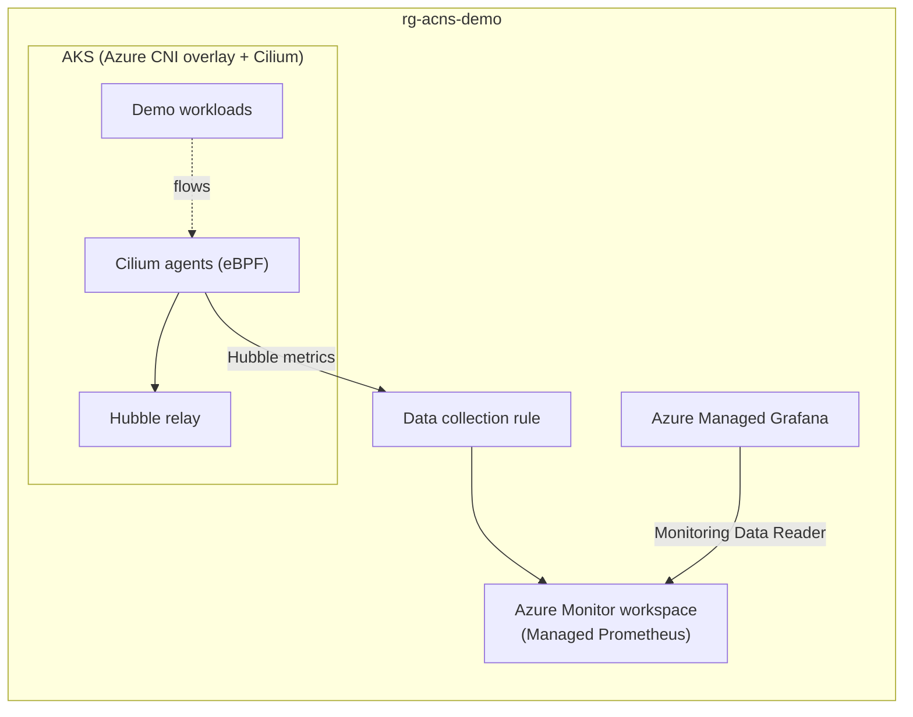

# AKS Advanced Container Networking Services (ACNS) with Cilium — Terraform

Deep network traffic visibility and security on Azure Kubernetes Service using **Advanced Container Networking Services** with **Azure CNI Powered by Cilium**, provisioned entirely with **Terraform**.

## 📋 Overview

Advanced Container Networking Services (ACNS) is a suite of services that enhances AKS networking with:

| Feature | Description | Data Plane |
|---------|-------------|------------|
| **Container Network Observability** | eBPF-based metrics (Hubble) + flow logs for pod, service, and DNS traffic | Cilium & non-Cilium |
| **Container Network Security** | FQDN filtering and Layer 7 policies enforced at kernel level | Cilium only |
| **Container Network Performance** | eBPF host routing for optimized traffic flow | Cilium only |

> **Note**: Container Network Security requires **Azure CNI Powered by Cilium** with Kubernetes **1.29+**.

## 🏗️ Architecture



Terraform provisions:

- AKS cluster: Azure CNI **overlay** mode, **Cilium** data plane and network policy, ACNS observability + security enabled
- Custom node resource group (`rg-aks-acns-demo-nodes`), cluster autoscaler
- Azure Monitor workspace (Managed Prometheus) + data collection endpoint/rule/association
- Azure Managed Grafana wired to Prometheus, with prebuilt Kubernetes networking dashboards
- Role assignments (Grafana → `Monitoring Data Reader`, you → `Grafana Admin`)

## 📁 Contents

```
AKS-ACNS-Cilium-Terraform/
├── README.md
├── deploy.sh                             # One-command deployment
├── cleanup.sh                            # Destroy everything
├── terraform/
│   ├── versions.tf                       # Providers (azurerm ~> 4.31, azapi ~> 2.2)
│   ├── variables.tf
│   ├── main.tf                           # AKS + ACNS (L7) + Prometheus + Grafana
│   ├── outputs.tf
│   └── terraform.tfvars.example
└── kubernetes-manifests/
    ├── 01-traffic-demo.yaml              # Baseline pod-to-pod and egress traffic
    ├── 02-fqdn-demo-client.yaml          # Test pod for FQDN filtering
    ├── 03-fqdn-filtering-policy.yaml     # CiliumNetworkPolicy (FQDN egress)
    ├── 04-l7-demo-apps.yaml              # HTTP server/client for L7 demo
    ├── 05-l7-policy.yaml                 # CiliumNetworkPolicy (L7 HTTP rules)
    ├── 06-prometheus-hubble-metrics.yaml # Keep Hubble flow metrics in Managed Prometheus
    ├── 07-dns-traffic-generator.yaml     # Continuous DNS query generator pods
    ├── 08-dns-metrics-trigger-policy.yaml # DNS/FQDN Cilium policy for DNS metrics
    ├── 09-dns-error-generator.yaml       # Optional workload that generates DNS lookup failures
    ├── 10-dns-error-deny-egress.yaml     # Optional deny policy to force DNS failures
    ├── 11-l7-load-generator.yaml         # Continuous HTTP load for L7 dashboards
    └── 12-l7-client-egress-policy.yaml   # Client-side L7 egress policy for outgoing HTTP metrics
```

## ✅ Prerequisites

- Azure CLI **2.79.0+** (`az login` completed)
- Terraform **1.6+**
- `kubectl`
- Optional: [Hubble CLI](https://github.com/cilium/hubble/releases) for flow inspection

## 🚀 Quick Start

```bash
./deploy.sh   # infra + observability + security (ACNS in L7 policy mode)
```

The script runs `terraform init/apply`, fetches AKS credentials, verifies the Cilium/Hubble components, and prints the Grafana URL. Terraform provisions ACNS directly in **L7 policy mode** (which is a superset of FQDN filtering), so both FQDN and L7 demos work without extra steps. The legacy `--enable-l7` flag remains as a no-op safety net that re-applies the same setting through `az aks update`.

Or run Terraform directly:

```bash
cd terraform
cp terraform.tfvars.example terraform.tfvars   # adjust values
terraform init
terraform apply
```

The key part of the cluster definition:

```hcl
network_profile {
  network_plugin      = "azure"
  network_plugin_mode = "overlay"
  network_data_plane  = "cilium"
  network_policy      = "cilium"

  advanced_networking {
    observability_enabled = true
    security_enabled      = true
  }
}
```

ACNS is put into **L7 policy mode** declaratively via `azapi` because the `azurerm` provider does not expose that field yet:

```hcl
resource "azapi_update_resource" "acns_l7_policy_mode" {
  type        = "Microsoft.ContainerService/managedClusters@2025-04-01"
  resource_id = azurerm_kubernetes_cluster.this.id

  body = {
    properties = {
      networkProfile = {
        advancedNetworking = {
          security = {
            advancedNetworkPolicies = "L7"
          }
        }
      }
    }
  }
}
```

> **L7 policies**: the `azurerm` provider's `advanced_networking` block does not yet expose the `advancedNetworkPolicies` mode (`FQDN` / `L7`). Terraform declares that setting via an `azapi_update_resource` on the AKS cluster, so `terraform apply` provisions ACNS in **L7 mode** end-to-end. No extra `az aks update` step is required.

## 🔭 Demo 1: Container Network Observability

> All demo manifests are standardized to the `traffic-demo` namespace to avoid namespace confusion.

### Generate traffic

```bash
kubectl apply -f kubernetes-manifests/06-prometheus-hubble-metrics.yaml
kubectl apply -f kubernetes-manifests/01-traffic-demo.yaml
kubectl apply -f kubernetes-manifests/07-dns-traffic-generator.yaml
kubectl apply -f kubernetes-manifests/08-dns-metrics-trigger-policy.yaml
```

The first manifest expands Azure Monitor's minimal-ingestion keep-list for the `networkobservabilityHubble` and `networkobservabilityCilium` targets. Without it, high-cardinality flow metrics such as `hubble_flows_processed_total` are scraped but discarded, leaving the ACNS flow dashboards empty. Managed Prometheus reloads the configuration automatically; allow a few minutes for new series to appear.

The baseline traffic manifest creates a `traffic-demo` namespace with clients producing pod-to-pod HTTP traffic, external DNS lookups, and intentionally failing connections. The DNS generator deployment continuously issues DNS lookups, while the DNS trigger policy routes those lookups through Cilium's DNS-aware policy path so DNS panels in Grafana populate consistently.

Quick validation:

```bash
kubectl -n traffic-demo get pods -l app=dns-traffic-generator
kubectl -n traffic-demo logs deploy/dns-traffic-generator --tail=20
kubectl -n traffic-demo rollout status deploy/dns-traffic-generator
```

Optional scale-up for faster dashboard population:

```bash
kubectl -n traffic-demo scale deploy/dns-traffic-generator --replicas=4
```

Generate DNS errors on demand (optional):

```bash
kubectl apply -f kubernetes-manifests/09-dns-error-generator.yaml
kubectl apply -f kubernetes-manifests/10-dns-error-deny-egress.yaml
```

This creates dedicated pods that continuously attempt DNS lookups while egress is denied. The failed lookups are useful for demonstrating error/drop behavior in networking dashboards.

Disable DNS error traffic:

```bash
kubectl delete -f kubernetes-manifests/10-dns-error-deny-egress.yaml --ignore-not-found
kubectl delete -f kubernetes-manifests/09-dns-error-generator.yaml --ignore-not-found
```

Keep it running continuously:

```bash
# If DNS charts flatten, restart pods without deleting objects
kubectl -n traffic-demo rollout restart deploy/dns-traffic-generator

# Verify all replicas are Ready
kubectl -n traffic-demo get deploy dns-traffic-generator
kubectl -n traffic-demo get pods -l app=dns-traffic-generator -w
```

The deployment is configured with three replicas and liveness/readiness probes. If a pod gets stuck and stops producing DNS lookups, Kubernetes restarts it automatically.

### Explore Grafana dashboards

Open the Grafana URL from the deploy output (`terraform -chdir=terraform output -raw grafana_endpoint`) and browse **Dashboards → Azure Managed Prometheus** folder. The prebuilt dashboards are named **"Kubernetes / Networking / `<name>`"**:

- **Clusters** — node-level traffic, drops, TCP state
- **DNS (Cluster)** / **DNS (Workload)** — DNS request/response rates and errors
- **Drops (Workload)** — drops to/from a specific workload
- **Pod Flows (Namespace)** / **Pod Flows (Workload)** — L4/L7 packet flows

> On Cilium clusters, the DNS dashboards only populate when a Cilium FQDN/DNS network policy applies to the workload — that is exactly what `08-dns-metrics-trigger-policy.yaml` provides ([docs](https://learn.microsoft.com/en-us/azure/aks/container-network-observability-metrics)).

### Inspect flows with Hubble CLI

```bash
# Port-forward the Hubble relay
kubectl port-forward -n kube-system svc/hubble-relay 4245:443 &

# Export the ACNS-managed Hubble client mTLS credentials
kubectl get secret hubble-relay-client-certs -n kube-system \
  -o jsonpath='{.data.tls\.crt}' | base64 -d > /tmp/hubble-client.crt
kubectl get secret hubble-relay-client-certs -n kube-system \
  -o jsonpath='{.data.tls\.key}' | base64 -d > /tmp/hubble-client.key
kubectl get secret hubble-relay-client-certs -n kube-system \
  -o jsonpath='{.data.ca\.crt}' | base64 -d > /tmp/hubble-ca.crt

# Configure Hubble CLI for the relay's mTLS endpoint
hubble config set tls true
hubble config set tls-server-name instance.hubble-relay.cilium.io
hubble config set tls-ca-cert-files /tmp/hubble-ca.crt
hubble config set tls-client-cert-file /tmp/hubble-client.crt
hubble config set tls-client-key-file /tmp/hubble-client.key

# Validate the connection and watch live flows
hubble status

hubble observe --namespace traffic-demo
hubble observe --verdict DROPPED
```

The relay uses mutual TLS. If the client certificate and key are not configured, the relay closes the forwarded connection and `kubectl port-forward` reports `broken pipe`.

## 🔒 Demo 2: FQDN Filtering (Container Network Security)

Restrict egress by domain name instead of IP addresses:

```bash
kubectl apply -f kubernetes-manifests/02-fqdn-demo-client.yaml
kubectl apply -f kubernetes-manifests/03-fqdn-filtering-policy.yaml

# Allowed — *.bing.com matches the policy
kubectl exec -n traffic-demo deploy/demo-client -- ./agnhost connect www.bing.com:80 --timeout=5s

# Blocked — DNS for other domains is denied
kubectl exec -n traffic-demo deploy/demo-client -- ./agnhost connect www.example.com:80 --timeout=5s
```

`02-fqdn-demo-client.yaml` and `03-fqdn-filtering-policy.yaml` explicitly target `traffic-demo`.

How it works: the `CiliumNetworkPolicy` allows DNS lookups only for `*.bing.com` via kube-dns, then permits egress only to the resolved IPs (`toFQDNs`). Everything else is dropped in-kernel by eBPF — watch it live with `hubble observe --verdict DROPPED -n traffic-demo`.

## 🛡️ Demo 3: Layer 7 Policy and HTTP Observability

ACNS is provisioned in **L7 mode** by Terraform (`azapi_update_resource.acns_l7_policy_mode`), so `CiliumNetworkPolicy` resources with `http` rules are accepted by the Azure validating admission policy and enforced by a node-local Cilium Envoy proxy.

### 1. Deploy the demo apps and policies

```bash
kubectl apply -f kubernetes-manifests/04-l7-demo-apps.yaml
kubectl apply -f kubernetes-manifests/05-l7-policy.yaml
kubectl apply -f kubernetes-manifests/12-l7-client-egress-policy.yaml
```

What each manifest does:

- `04-l7-demo-apps.yaml` — deploys `http-server` (nginx) and `http-client` (curl). The nginx config exposes:
  - `GET /` and `GET /products` returning `200`
  - `GET /status/{200,201,204,301,302,400,401,404,418,429,500,502,503}` returning the requested status code
- `05-l7-policy.yaml` — ingress L7 policy on `http-server` that allows only `GET /`, `GET /products`, and `GET /status/[0-9]+` from `http-client`. Any other method or path (for example `POST /products` or `GET /admin`) is denied by Envoy with **HTTP 403**.
- `12-l7-client-egress-policy.yaml` — egress L7 policy on `http-client` that attaches an Envoy proxy on the client side. Without this, Hubble only reports `reporter="server"` metrics and the Grafana **Outgoing HTTP** panels stay empty.

### 2. Confirm policy enforcement

```bash
# Allowed — GET /products
kubectl exec -n traffic-demo deploy/http-client -- curl -s http://http-server/products

# Allowed — GET / (root)
kubectl exec -n traffic-demo deploy/http-client -- curl -s http://http-server/

# Allowed — server-generated status codes (200/201/204/301/302/400/401/404/418/429/500/502/503)
kubectl exec -n traffic-demo deploy/http-client -- \
  sh -c 'for c in 200 201 204 301 302 400 401 404 418 429 500 502 503; do \
           printf "%s -> %s\n" "$c" "$(curl -s -o /dev/null -w %{http_code} http://http-server/status/$c)"; \
         done'

# Denied by policy (403) — POST /products
kubectl exec -n traffic-demo deploy/http-client -- curl -s -o /dev/null -w '%{http_code}\n' -X POST http://http-server/products

# Denied by policy (403) — GET /admin (not in allowed paths)
kubectl exec -n traffic-demo deploy/http-client -- curl -s -o /dev/null -w '%{http_code}\n' http://http-server/admin
```

### 3. Continuous multi-status load generator

To drive the Grafana **L7 Flows / HTTP** dashboards with realistic 2xx / 3xx / 4xx / 5xx activity:

```bash
kubectl apply -f kubernetes-manifests/11-l7-load-generator.yaml
kubectl -n traffic-demo rollout restart deploy/http-client deploy/http-load
kubectl -n traffic-demo get pods -l role=load
```

The `http-load` deployment runs a curl loop that in each iteration:

1. Hits every `/status/<code>` endpoint (server-generated 2xx / 3xx / 4xx / 5xx)
2. Hits `GET /products` and `GET /` (allowed)
3. Hits `POST /products` and `GET /admin` (denied by policy, Envoy returns 403)

The `rollout restart` is important the first time: Cilium regenerates the client pods' endpoints so the Envoy proxy is attached and `reporter="client"` metrics start flowing.

### 4. Verify metrics in Managed Prometheus

Get an access token and query the workspace directly:

```bash
MON_ID=$(terraform -chdir=terraform output -raw monitor_workspace_id)
PROM_URL=$(az resource show --ids "$MON_ID" \
  --query properties.metrics.prometheusQueryEndpoint -o tsv)
TOKEN=$(az account get-access-token \
  --resource https://prometheus.monitor.azure.com --query accessToken -o tsv)

curl -fsS -H "Authorization: Bearer $TOKEN" --get \
  --data-urlencode 'query=sum by (reporter,status) (increase(hubble_http_requests_total[3m]))' \
  "$PROM_URL/api/v1/query" | jq '.data.result'
```

Useful PromQL for Grafana **Explore**:

```promql
# Overall request rate by reporter (client = outgoing, server = incoming)
sum by (reporter) (rate(hubble_http_requests_total[2m]))

# Full status-code breakdown (both directions)
sum by (reporter,status,method) (rate(hubble_http_requests_total[2m]))

# Error rate (4xx + 5xx)
sum by (reporter) (rate(hubble_http_requests_total{status=~"4..|5.."}[2m]))

# Latency percentiles
histogram_quantile(0.95,
  sum by (le,reporter) (rate(hubble_http_request_duration_seconds_bucket[2m])))
```

The expected Grafana L7 dashboards (folder **Azure Managed Prometheus**):

- **Kubernetes / Networking / L7 (Namespace)** — HTTP/gRPC/Kafka flows at namespace level
- **Kubernetes / Networking / L7 (Workload)** — per-workload L7 breakdown

These dashboards only display data when L7 policies are applied to the workloads — the metrics themselves are collected by the Hubble agent (observability), not by Envoy ([docs](https://learn.microsoft.com/en-us/azure/aks/container-network-security-l7-policy-concepts)).

### 5. Turn the L7 load off

```bash
kubectl delete -f kubernetes-manifests/11-l7-load-generator.yaml --ignore-not-found
kubectl delete -f kubernetes-manifests/12-l7-client-egress-policy.yaml --ignore-not-found
kubectl delete -f kubernetes-manifests/05-l7-policy.yaml --ignore-not-found
kubectl delete -f kubernetes-manifests/04-l7-demo-apps.yaml --ignore-not-found
```

The policy is enforced by a node-local Envoy proxy — part of the ACNS security agent, deployed as its own DaemonSet decoupled from the Cilium agent. It is HTTP method/path aware and returns application-level error codes (HTTP 403) instead of silently dropping traffic, with L7 flow metrics visible in Hubble and Grafana.

## 🧹 Cleanup

```bash
./cleanup.sh
```

## 📚 References

- [Advanced Container Networking Services overview](https://learn.microsoft.com/en-us/azure/aks/advanced-container-networking-services-overview)
- [Enable ACNS on AKS clusters (Cilium)](https://learn.microsoft.com/en-us/azure/aks/use-advanced-container-networking-services?pivots=cilium)
- [Container network observability metrics](https://learn.microsoft.com/en-us/azure/aks/container-network-observability-metrics)
- [FQDN-based filtering concepts](https://learn.microsoft.com/en-us/azure/aks/container-network-security-fqdn-filtering-concepts)
- [Layer 7 policy concepts](https://learn.microsoft.com/en-us/azure/aks/container-network-security-l7-policy-concepts)
