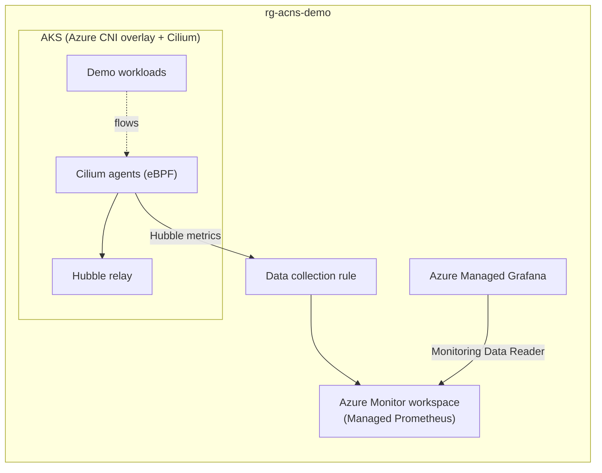

# AKS Advanced Container Networking Services (ACNS) with Cilium — Terraform

Deep network traffic visibility and security on Azure Kubernetes Service using **Advanced Container Networking Services** with **Azure CNI Powered by Cilium**, provisioned entirely with **Terraform**.

## 📋 Overview

Advanced Container Networking Services (ACNS) is a suite of services that enhances AKS networking with:

| Feature | Description | Data Plane |
|---------|-------------|------------|
| **Container Network Observability** | eBPF-based metrics (Hubble) + flow logs for pod, service, and DNS traffic | Cilium & non-Cilium |
| **Container Network Security** | FQDN filtering and Layer 7 policies enforced at kernel level | Cilium only |
| **Container Network Performance** | eBPF host routing for optimized traffic flow | Cilium only |

> **Note**: Container Network Security requires **Azure CNI Powered by Cilium** with Kubernetes **1.29+**.

## 🏗️ Architecture



Terraform provisions:

- AKS cluster: Azure CNI **overlay** mode, **Cilium** data plane and network policy, ACNS observability + security enabled
- Custom node resource group (`rg-aks-acns-demo-nodes`), 3 availability zones, cluster autoscaler
- Azure Monitor workspace (Managed Prometheus) + data collection endpoint/rule/association
- Azure Managed Grafana wired to Prometheus, with prebuilt Kubernetes networking dashboards
- Role assignments (Grafana → `Monitoring Data Reader`, you → `Grafana Admin`)

## 📁 Contents

```
AKS-ACNS-Cilium-Terraform/
├── README.md
├── deploy.sh                             # One-command deployment
├── cleanup.sh                            # Destroy everything
├── terraform/
│   ├── versions.tf                       # Providers (azurerm ~> 4.31)
│   ├── variables.tf
│   ├── main.tf                           # AKS + ACNS + Prometheus + Grafana
│   ├── outputs.tf
│   └── terraform.tfvars.example
└── kubernetes-manifests/
    ├── 01-traffic-demo.yaml              # Continuous traffic generator
    ├── 02-fqdn-demo-client.yaml          # Test pod for FQDN filtering
    ├── 03-fqdn-filtering-policy.yaml     # CiliumNetworkPolicy (FQDN egress)
    ├── 04-l7-demo-apps.yaml              # HTTP server/client for L7 demo
    └── 05-l7-policy.yaml                 # CiliumNetworkPolicy (L7 HTTP rules)
```

## ✅ Prerequisites

- Azure CLI **2.79.0+** (`az login` completed)
- Terraform **1.6+**
- `kubectl`
- Optional: [Hubble CLI](https://github.com/cilium/hubble/releases) for flow inspection

## 🚀 Quick Start

```bash
./deploy.sh              # infra + observability (FQDN policies enabled by default)
./deploy.sh --enable-l7  # also enable Layer 7 network policies
```

The script runs `terraform init/apply`, fetches AKS credentials, verifies the Cilium/Hubble components, and prints the Grafana URL.

Or run Terraform directly:

```bash
cd terraform
cp terraform.tfvars.example terraform.tfvars   # adjust values
terraform init
terraform apply
```

The key part of the cluster definition:

```hcl
network_profile {
  network_plugin      = "azure"
  network_plugin_mode = "overlay"
  network_data_plane  = "cilium"
  network_policy      = "cilium"

  advanced_networking {
    observability_enabled = true
    security_enabled      = true
  }
}
```

> **L7 policies**: the `azurerm` provider currently exposes only the observability/security toggles. `deploy.sh --enable-l7` runs `az aks update --acns-advanced-networkpolicies L7` on top of the Terraform-provisioned cluster.

## 🔭 Demo 1: Container Network Observability

### Generate traffic

```bash
kubectl apply -f kubernetes-manifests/01-traffic-demo.yaml
```

This creates a `traffic-demo` namespace with clients producing pod-to-pod HTTP traffic, external DNS lookups, and intentionally failing connections.

### Explore Grafana dashboards

Open the Grafana URL from the deploy output (`terraform -chdir=terraform output -raw grafana_endpoint`) and browse **Dashboards → Azure Managed Prometheus** folder:

- **Kubernetes / Networking / Clusters** — cluster-wide traffic, drops, TCP state
- **Kubernetes / Networking / DNS** — DNS request/response rates and errors
- **Kubernetes / Networking (Workload)** — per-workload traffic breakdown

### Inspect flows with Hubble CLI

```bash
# Port-forward the Hubble relay
kubectl port-forward -n kube-system svc/hubble-relay 4245:443 &

# Watch live flows (TLS certs are managed by ACNS)
hubble config set tls true
hubble config set tls-server-name instance.hubble-relay.cilium.io
kubectl get secret hubble-relay-client-certs -n kube-system \
  -o jsonpath='{.data.ca\.crt}' | base64 -d > /tmp/hubble-ca.crt
hubble config set tls-ca-cert-files /tmp/hubble-ca.crt

hubble observe --namespace traffic-demo
hubble observe --verdict DROPPED
```

## 🔒 Demo 2: FQDN Filtering (Container Network Security)

Restrict egress by domain name instead of IP addresses:

```bash
kubectl create ns demo
kubectl apply -n demo -f kubernetes-manifests/02-fqdn-demo-client.yaml
kubectl apply -n demo -f kubernetes-manifests/03-fqdn-filtering-policy.yaml

# Allowed — *.bing.com matches the policy
kubectl exec -n demo deploy/demo-client -- ./agnhost connect www.bing.com:80 --timeout=5s

# Blocked — DNS for other domains is denied
kubectl exec -n demo deploy/demo-client -- ./agnhost connect www.example.com:80 --timeout=5s
```

How it works: the `CiliumNetworkPolicy` allows DNS lookups only for `*.bing.com` via kube-dns, then permits egress only to the resolved IPs (`toFQDNs`). Everything else is dropped in-kernel by eBPF — watch it live with `hubble observe --verdict DROPPED -n demo`.

## 🛡️ Demo 3: Layer 7 Policy

Requires `./deploy.sh --enable-l7` (or `az aks update --enable-acns --acns-advanced-networkpolicies L7`).

```bash
kubectl create ns l7-demo
kubectl apply -n l7-demo -f kubernetes-manifests/04-l7-demo-apps.yaml
kubectl apply -n l7-demo -f kubernetes-manifests/05-l7-policy.yaml

# Allowed — GET /products
kubectl exec -n l7-demo deploy/http-client -- curl -s http://http-server/products

# Denied (403) — POST to the same path
kubectl exec -n l7-demo deploy/http-client -- curl -s -X POST http://http-server/products

# Denied (403) — GET to a different path
kubectl exec -n l7-demo deploy/http-client -- curl -s http://http-server/
```

The policy is enforced by a node-local Envoy proxy managed by Cilium — HTTP method/path aware, with L7 flow metrics visible in Hubble and Grafana.

## 🧹 Cleanup

```bash
./cleanup.sh
```

## 📚 References

- [Advanced Container Networking Services overview](https://learn.microsoft.com/en-us/azure/aks/advanced-container-networking-services-overview)
- [Enable ACNS on AKS clusters (Cilium)](https://learn.microsoft.com/en-us/azure/aks/use-advanced-container-networking-services?pivots=cilium)
- [Container network observability metrics](https://learn.microsoft.com/en-us/azure/aks/container-network-observability-metrics)
- [FQDN-based filtering concepts](https://learn.microsoft.com/en-us/azure/aks/container-network-security-fqdn-filtering-concepts)
- [Layer 7 policy concepts](https://learn.microsoft.com/en-us/azure/aks/container-network-security-l7-policy-concepts)
