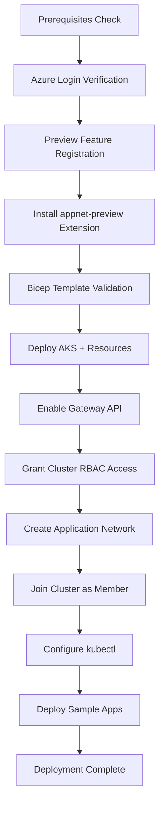

# Azure Kubernetes Application Network for AKS Demo

> **Preview Feature**: This demonstration showcases Azure Kubernetes Application Network for AKS, a managed service mesh solution built on Istio ambient mode that provides zero-trust networking, automatic mTLS, and identity-based authorization without requiring sidecars.

[](https://learn.microsoft.com/en-us/azure/application-network/)
[](https://azure.microsoft.com/en-us/products/kubernetes-service)
[](https://learn.microsoft.com/en-us/azure/azure-resource-manager/bicep/)

## 📖 Table of Contents

- [Overview](#overview)
- [What is Azure Kubernetes Application Network](#what-is-azure-kubernetes-application-network)
- [Architecture](#architecture)
- [Key Features](#key-features)
- [Project Structure](#project-structure)
- [Prerequisites](#prerequisites)
- [Getting Started](#getting-started)
- [Demo Walkthrough](#demo-walkthrough)
- [Observability](#observability)
- [Troubleshooting](#troubleshooting)
- [Cleanup](#cleanup)
- [Additional Resources](#additional-resources)

---

## Overview

This repository provides a complete, production-ready demonstration of Azure Kubernetes Application Network for AKS. It includes:

- **Infrastructure as Code**: Bicep templates for deploying AKS clusters with all required configurations
- **Automated Deployment**: End-to-end shell scripts for provisioning, configuration, and teardown
- **Sample Applications**: Real-world microservices demonstrating ambient mesh, waypoint proxies, and authorization policies
- **Comprehensive Documentation**: Step-by-step guides for understanding and operating the platform

**Use Cases Demonstrated:**
- Automatic service-to-service encryption with mTLS
- Identity-based authorization without IP addresses
- L7 traffic management with waypoint proxies
- Certificate lifecycle automation
- Multi-cluster service mesh readiness

---

## What is Azure Kubernetes Application Network?

Azure Kubernetes Application Network is Microsoft's managed service mesh offering for AKS that eliminates the complexity of traditional service mesh deployments while providing enterprise-grade security and observability.

### The Challenge It Solves

Traditional Kubernetes provides network connectivity, but lacks:
- **Encrypted communication** between services by default
- **Identity-based access control** (relies on network policies)
- **Centralized traffic management** and policy enforcement
- **Automatic certificate management** and rotation
- **Cross-cluster service discovery** without manual configuration

### How Application Network Addresses This

Application Network provides a **fully managed control plane** with:

1. **Zero-Touch mTLS**: Automatic encryption of all service-to-service traffic
2. **Workload Identity**: SPIFFE-based identities for every pod
3. **Ambient Mode**: No sidecar proxies required (lightweight ztunnel DaemonSet)
4. **Certificate Automation**: Root CA, intermediate CA, and workload cert lifecycle fully managed
5. **Policy-Driven Security**: Authorization based on verified identities, not IP addresses
6. **Optional L7 Processing**: Waypoint proxies for advanced HTTP routing and policies

---

## Architecture

### Three-Tier Architecture

```
┌─────────────────────────────────────────────────────────────┐
│  Management Plane (Azure Resource Manager)                  │
│  - Application Network resource creation                    │
│  - Member cluster registration                              │
│  - RBAC and identity management                            │
└────────────────┬────────────────────────────────────────────┘
                 │
┌────────────────▼────────────────────────────────────────────┐
│  Control Plane (Managed by Microsoft)                       │
│  - Istiod (service discovery, xDS config push)             │
│  - Certificate Authority (backed by Azure Key Vault)        │
│  - Multi-cluster coordination                               │
│  - Lifecycle management (upgrades, cert rotation)          │
└────────────────┬────────────────────────────────────────────┘
                 │
┌────────────────▼────────────────────────────────────────────┐
│  Data Plane (applink-system namespace in AKS)              │
│  - ztunnel (L4 proxy DaemonSet)                            │
│  - Istio CNI (traffic interception)                        │
│  - Waypoint proxies (optional L7 processing)               │
│  - East-west gateway (multi-cluster traffic)               │
└─────────────────────────────────────────────────────────────┘
```

### Demo Infrastructure Layout

```
Azure Subscription
├── Resource Group: rg-appnet-demo
│   ├── AKS Cluster: aks-appnet-demo
│   │   ├── Node Resource Group: rg-appnet-demo-nodes
│   │   ├── System Node Pool (2-5 nodes, autoscaling)
│   │   └── Managed Identity (OIDC-enabled)
│   └── Log Analytics Workspace: law-appnet-demo-*
│
└── Resource Group: rg-appnet-resource-demo
    └── Application Network: appnet-demo
        ├── Root CA (12-month validity)
        └── Member: member-aks-appnet-demo
            ├── Intermediate CA (90-day validity)
            └── Workload Certificates (24-hour validity)
```

### In-Cluster Components

```
AKS Cluster: aks-appnet-demo
├── Namespace: applink-system (managed by Application Network)
│   ├── DaemonSet: ztunnel (L4 proxy on every node)
│   ├── DaemonSet: istio-cni (traffic redirection)
│   └── ConfigMap: istio-root-cert (Application Network root CA)
│
└── Namespace: demo (your workloads)
    ├── Deployment: sleep (client with SA: sleep)
    ├── Deployment: httpbin (server with SA: httpbin)
    ├── Gateway: waypoint (optional L7 proxy)
    └── AuthorizationPolicy: allow-sleep-to-httpbin
```

---

## Key Features

### 🔐 Security

| Feature | Description | Implementation |
|---------|-------------|----------------|
| **Automatic mTLS** | All pod-to-pod traffic encrypted | Enforced by ztunnel, FIPS-compliant ciphers |
| **Workload Identity** | SPIFFE-based identity per service account | Format: `cluster.local/ns/<namespace>/sa/<sa>` |
| **Certificate Management** | Fully automated issuance and rotation | Root CA → Intermediate CA → Workload certs |
| **Identity-Based AuthZ** | Policies use verified identities | No IP addresses in AuthorizationPolicy |
| **Zero Trust** | Deny-by-default with explicit allow rules | Controlled via Istio AuthorizationPolicy CRDs |

### 🚀 Traffic Management

- **L4 (ztunnel)**: Connection-level mTLS, transparent to applications
- **L7 (waypoint)**: HTTP routing, retries, timeouts, fault injection
- **Gateway API**: Kubernetes-native ingress and mesh gateway configuration
- **Multi-Cluster**: Service discovery across member clusters via east-west gateways

### 📊 Observability

- **Prometheus Metrics**: Automatically scraped from ztunnel and waypoints
- **Azure Monitor Integration**: Container logs, control plane logs
- **Grafana Dashboards**: Pre-configured for Application Network metrics
- **Distributed Tracing**: (Roadmap - not available in preview)

---

## Project Structure

```
AKS-Application-Network/
├── main.bicep                      # Subscription-scoped IaC orchestrator
├── main.bicepparam                 # Environment configuration
├── deploy.sh                       # End-to-end deployment automation
├── cleanup.sh                      # Safe teardown script
├── commands.azcli                  # Reference CLI commands
├── README.md                       # This file
│
├── modules/                        # Bicep modules
│   ├── aks.bicep                  # AKS cluster with required configs
│   └── log-analytics.bicep        # Monitoring workspace
│
└── sample-apps/                    # Kubernetes manifests
    ├── namespace.yaml             # Demo namespace with ambient label
    ├── httpbin.yaml               # Sample HTTP service
    ├── sleep.yaml                 # Sample client pod
    ├── waypoint.yaml              # L7 gateway proxy
    └── authorization-policy.yaml  # Identity-based access control
```

---

## Prerequisites

### Required Tools

| Tool | Minimum Version | Installation |
|------|----------------|--------------|
| Azure CLI | 2.84.0 | [Install Guide](https://learn.microsoft.com/en-us/cli/azure/install-azure-cli) |
| kubectl | 1.28+ | `az aks install-cli` or [Kubernetes Docs](https://kubernetes.io/docs/tasks/tools/) |
| Bicep | Latest | `az bicep install` |

### Azure Requirements

- **Subscription**: Owner or Contributor role
- **User RBAC**: The deployment script will automatically grant the current user "Azure Kubernetes Service Cluster Admin Role" on the cluster
- **Quotas**: Sufficient quota for AKS (minimum 4 vCPUs)
- **Preview Registration**: Feature flags registered (automated by `deploy.sh`)

### Verify Prerequisites

```bash
# Check Azure CLI version
az --version | grep azure-cli

# Check kubectl
kubectl version --client

# Check Bicep
az bicep version

# Login to Azure
az login
az account show
```

---

## Getting Started

### Quick Deploy (5 minutes setup, 15-20 minutes deployment)

```bash
# 1. Clone and navigate
cd AKS-Application-Network

# 2. Make scripts executable
chmod +x deploy.sh cleanup.sh

# 3. Run deployment
./deploy.sh
```

### What `deploy.sh` Does

The deployment script executes the following workflow:



**Detailed Steps:**

1. **Prerequisites Check**: Validates Azure CLI, kubectl availability
2. **Subscription Confirmation**: Displays current subscription, prompts for confirmation
3. **Feature Registration**: Registers `Microsoft.AppLink/PublicPreview` feature
4. **Extension Installation**: Installs/updates `appnet-preview` Azure CLI extension
5. **Infrastructure Deployment**: 
   - Creates AKS resource group (`rg-appnet-demo`)
   - Deploys AKS cluster with Entra ID, OIDC issuer
   - Creates Log Analytics workspace
   - Provisions custom node resource group
6. **Gateway API Enablement**: Enables Kubernetes Gateway API on AKS
7. **Cluster RBAC Access**: Grants current Azure user "Azure Kubernetes Service Cluster Admin Role" for kubectl access
8. **Application Network Creation**:
   - Creates Application Network resource group (`rg-appnet-resource-demo`)
   - Provisions Application Network resource with system-assigned identity
   - Provisions root CA backed by Azure Key Vault
9. **Member Join**:
   - Registers AKS cluster as member
   - Waits for provisioning state `Succeeded`
   - Deploys data plane components to `applink-system` namespace
10. **kubectl Configuration**: Downloads cluster credentials
11. **Sample Apps Deployment**:
    - Creates `demo` namespace with ambient label
    - Deploys `httpbin` and `sleep` workloads
    - Waits for pod readiness

### Custom Configuration

Override default values via environment variables:

```bash
export LOCATION="westus2"
export ENVIRONMENT="prod"
export AKS_RG="rg-appnet-prod"
export APPNET_RG="rg-appnet-resource-prod"
export CLUSTER_NAME="aks-appnet-prod"
export APPNET_NAME="appnet-prod"
export APPNET_MEMBER_NAME="member-aks-appnet-prod"

./deploy.sh
```

Or edit `main.bicepparam` directly:

```bicep
param location = 'westus2'
param environmentName = 'prod'
param kubernetesVersion = '1.32'
param systemNodeCount = 3
```

---

## Demo Walkthrough

### Scenario 1: Baseline mTLS Connectivity

**Objective**: Verify that ambient mesh automatically encrypts traffic between services.

```bash
# 1. Check that ztunnel is running on all nodes
kubectl get pods -n applink-system -l app=ztunnel

# 2. Verify demo namespace is labeled for ambient
kubectl get namespace demo --show-labels

# 3. Test connectivity (mTLS is automatic, transparent to app)
kubectl exec -n demo deploy/sleep -- curl -s http://httpbin.demo.svc.cluster.local/get

# Expected: HTTP 200 with JSON response
```

**What's Happening:**
- ztunnel intercepts outbound traffic from `sleep` pod
- Establishes mTLS connection to ztunnel on `httpbin` node
- Forwards decrypted traffic to `httpbin` pod
- Return traffic follows same encrypted path

### Scenario 2: L7 Traffic Management with Waypoint

**Objective**: Enable advanced HTTP routing and policies using a waypoint proxy.

```bash
# 1. Deploy the waypoint Gateway
kubectl apply -f sample-apps/waypoint.yaml

# 2. Verify waypoint deployment
kubectl get gateway -n demo
kubectl get pods -n demo -l gateway.istio.io/managed=istio.io-mesh-controller

# 3. Label namespace to route through waypoint
kubectl label namespace demo istio.io/use-waypoint=waypoint

# 4. Test connectivity (now flows through L7 proxy)
kubectl exec -n demo deploy/sleep -- curl -s http://httpbin.demo.svc.cluster.local/headers
```

**Traffic Flow Change:**
```
Before: sleep -> ztunnel -> ztunnel -> httpbin
After:  sleep -> ztunnel -> waypoint -> ztunnel -> httpbin
```

### Scenario 3: Identity-Based Authorization

**Objective**: Restrict access to `httpbin` using workload identity, not IP addresses.

```bash
# 1. Apply AuthorizationPolicy
kubectl apply -f sample-apps/authorization-policy.yaml

# 2. View the policy
kubectl get authorizationpolicy -n demo -o yaml

# 3. Test from allowed identity (sleep SA)
kubectl exec -n demo deploy/sleep -- \
  curl -s -o /dev/null -w "%{http_code}\n" \
  http://httpbin.demo.svc.cluster.local/get

# Expected: 200

# 4. Test from denied identity
kubectl run test-denied --image=curlimages/curl --restart=Never -n demo -- \
  curl -s -o /dev/null -w "%{http_code}\n" \
  http://httpbin.demo.svc.cluster.local/get

# Expected: 403 (RBAC: access denied)

# Cleanup test pod
kubectl delete pod test-denied -n demo
```

**Policy Details:**
```yaml
spec:
  selector:
    matchLabels:
      app: httpbin
  action: ALLOW
  rules:
    - from:
        - source:
            principals:
              - cluster.local/ns/demo/sa/sleep  # Only this identity
```

### Scenario 4: Certificate Inspection

**Objective**: Examine the managed certificate hierarchy.

```bash
# 1. View the Application Network root CA
kubectl get configmap istio-root-cert -n applink-system -o yaml

# 2. Check ztunnel certificate metrics
kubectl exec -n applink-system ds/ztunnel -- \
  curl -s http://localhost:15020/metrics | grep certificate

# 3. Verify automatic rotation schedule
az appnet member show \
  --resource-group "$APPNET_RG" \
  --appnet-name "$APPNET_NAME" \
  --member-name "$APPNET_MEMBER_NAME" \
  --query properties.certificateProfile
```

**Certificate Hierarchy:**
```
Root CA (12-month validity, 6-month rotation)
  └─> Intermediate CA (90-day validity, 45-day rotation)
       └─> Workload Cert (24-hour validity, 12-hour rotation)
```

---

## Observability

### Metrics Collection

Application Network integrates with Azure Monitor:

```bash
# View member observability configuration
az appnet member show \
  --resource-group "$APPNET_RG" \
  --appnet-name "$APPNET_NAME" \
  --member-name "$APPNET_MEMBER_NAME" \
  --query properties.observabilityProfile
```

### Key Metrics

| Metric | Source | Description |
|--------|--------|-------------|
| `istio_requests_total` | ztunnel, waypoint | Request count by source, destination, response code |
| `istio_tcp_connections_opened_total` | ztunnel | TCP connections initiated |
| `pilot_xds_pushes` | Control plane | Configuration updates pushed to data plane |
| `certificate_expiry_timestamp` | ztunnel | Certificate expiration time |

### Accessing Metrics

```bash
# Port-forward to ztunnel metrics endpoint
kubectl port-forward -n applink-system ds/ztunnel 15020:15020

# Query metrics
curl http://localhost:15020/metrics
```

### Azure Monitor Queries (KQL)

```kql
// Container logs from applink-system
ContainerLog
| where Namespace == "applink-system"
| where TimeGenerated > ago(1h)
| project TimeGenerated, Computer, LogEntry
| order by TimeGenerated desc

// AKS control plane logs
AzureDiagnostics
| where Category == "kube-audit"
| where TimeGenerated > ago(1h)
| project TimeGenerated, log_s
```

---

## Troubleshooting

### Common Issues and Solutions

#### 1. Feature Registration Stuck

**Symptom:** `deploy.sh` hangs waiting for feature registration.

**Solution:**
```bash
# Check current state
az feature show \
  --namespace Microsoft.AppLink \
  --name PublicPreview \
  --query properties.state -o tsv

# If "Registering" for >10 minutes, contact Azure support
# Workaround: Skip registration if already in progress, proceed to next step
```

#### 2. Member Provisioning Fails

**Symptom:** Member shows `provisioningState: Failed`.

**Diagnosis:**
```bash
# Get detailed error
az appnet member show \
  --resource-group "$APPNET_RG" \
  --appnet-name "$APPNET_NAME" \
  --member-name "$APPNET_MEMBER_NAME" \
  --query properties.provisioningState

# Check cluster prerequisites
az aks show -g "$AKS_RG" -n "$CLUSTER_NAME" \
  --query "{oidc:oidcIssuerProfile.enabled,aad:aadProfile.managed,istio:serviceMeshProfile.mode}"
```

**Common Causes:**
- OIDC issuer not enabled
- Entra ID integration not enabled
- Istio add-on enabled (conflicts with Application Network)
- Gateway API not enabled

**Fix:**
```bash
# Enable missing features
az aks update -g "$AKS_RG" -n "$CLUSTER_NAME" \
  --enable-oidc-issuer \
  --enable-workload-identity \
  --enable-gateway-api
```

#### 3. ztunnel Pods CrashLooping

**Symptom:** `kubectl get pods -n applink-system` shows ztunnel in `CrashLoopBackOff`.

**Diagnosis:**
```bash
kubectl logs -n applink-system -l app=ztunnel --tail=50
```

**Common Causes:**
- CNI plugin conflicts
- Insufficient node resources
- Control plane connectivity issues

**Fix:**
```bash
# Restart ztunnel
kubectl rollout restart daemonset/ztunnel -n applink-system

# If persists, recreate member
az appnet member remove --resource-group "$APPNET_RG" --appnet-name "$APPNET_NAME" --member-name "$APPNET_MEMBER_NAME"
# Then re-join via deploy.sh
```

#### 4. Authorization Policy Not Enforced

**Symptom:** Requests succeed even when they should be denied.

**Diagnosis:**
```bash
# Verify waypoint is deployed (required for L7 policies)
kubectl get gateway -n demo

# Check namespace is using waypoint
kubectl get namespace demo -o jsonpath='{.metadata.labels.istio\.io/use-waypoint}'

# View policy status
kubectl get authorizationpolicy -n demo -o yaml
```

**Fix:**
```bash
# Ensure waypoint is labeled and running
kubectl label namespace demo istio.io/use-waypoint=waypoint --overwrite
kubectl get pods -n demo -l gateway.istio.io/managed
```

#### 5. Regional Capacity Issues

**Symptom:** Bicep deployment fails with quota or capacity errors.

**Solution:**
```bash
# Change region in main.bicepparam
param location = 'eastus2'  # Try different region

# Or use smaller VM size
param systemNodeVmSize = 'Standard_D2s_v3'
```

#### 6. RBAC Access Denied for Cluster

**Symptom:** `kubectl` commands fail with "User does not have access to the resource in Azure."

**Diagnosis:**
```bash
# Check your current Azure identity
az account show --query user.name -o tsv

# Verify role assignments on the cluster
az role assignment list \
  --scope $(az aks show -g "$AKS_RG" -n "$CLUSTER_NAME" --query id -o tsv) \
  --assignee $(az ad signed-in-user show --query id -o tsv)
```

**Fix:**
```bash
# Manual role assignment (deploy.sh does this automatically)
CLUSTER_ID=$(az aks show -g "$AKS_RG" -n "$CLUSTER_NAME" --query id -o tsv)
USER_ID=$(az ad signed-in-user show --query id -o tsv)

az role assignment create \
  --role "Azure Kubernetes Service Cluster Admin Role" \
  --assignee "$USER_ID" \
  --scope "$CLUSTER_ID"

# Wait for RBAC propagation (30-60 seconds)
sleep 30

# Refresh kubectl credentials
az aks get-credentials -g "$AKS_RG" -n "$CLUSTER_NAME" --overwrite-existing
```

---

## Cleanup

### Automated Cleanup

```bash
./cleanup.sh
```

**Cleanup workflow:**
1. Removes ambient labels from namespaces
2. Removes cluster from Application Network
3. Deletes Application Network resource
4. Deletes Application Network resource group
5. Deletes AKS resource group (includes cluster, node RG, Log Analytics)

### Manual Cleanup (if script fails)

```bash
# 1. Remove member
az appnet member remove \
  --resource-group rg-appnet-resource-demo \
  --appnet-name appnet-demo \
  --member-name member-aks-appnet-demo

# 2. Delete Application Network
az appnet delete \
  --resource-group rg-appnet-resource-demo \
  --name appnet-demo \
  --yes

# 3. Delete resource groups
az group delete --name rg-appnet-resource-demo --yes --no-wait
az group delete --name rg-appnet-demo --yes --no-wait
```

### Verify Cleanup

```bash
# Check resource groups
az group exists --name rg-appnet-demo
az group exists --name rg-appnet-resource-demo

# Should return "false" for both
```

---

## Additional Resources

### Official Documentation

- [Azure Kubernetes Application Network Overview](https://learn.microsoft.com/en-us/azure/application-network/overview)
- [Get Started Guide](https://learn.microsoft.com/en-us/azure/application-network/get-started)
- [Architecture Deep Dive](https://learn.microsoft.com/en-us/azure/application-network/architecture)
- [Security Model](https://learn.microsoft.com/en-us/azure/application-network/security)
- [Observability Features](https://learn.microsoft.com/en-us/azure/application-network/observability)

### Related Technologies

- [Istio Ambient Mesh](https://istio.io/latest/docs/ops/ambient/)
- [Kubernetes Gateway API](https://gateway-api.sigs.k8s.io/)
- [SPIFFE/SPIRE](https://spiffe.io/)

### Azure CLI Reference

- [`az appnet`](https://learn.microsoft.com/en-us/cli/azure/appnet)
- [`az aks`](https://learn.microsoft.com/en-us/cli/azure/aks)

### Support and Feedback

- **Preview Limitations**: Check [supported versions](https://learn.microsoft.com/en-us/azure/application-network/supported-versions)
- **Issues**: Report via [Azure Support](https://portal.azure.com/#blade/Microsoft_Azure_Support/HelpAndSupportBlade)
- **Community**: [AKS GitHub Discussions](https://github.com/Azure/AKS/discussions)

---

## License

This project is licensed under the MIT License - see the [LICENSE](../LICENSE) file for details.

## Contributing

Contributions are welcome! Please follow the repository's branching strategy:
- Create feature branches: `feature/<description>`
- Open pull requests against `main`
- Follow existing code style and conventions

---

**⚠️ Preview Notice**: Azure Kubernetes Application Network for AKS is currently in preview. Preview features are provided "as is" and are excluded from service-level agreements. Not recommended for production use.
