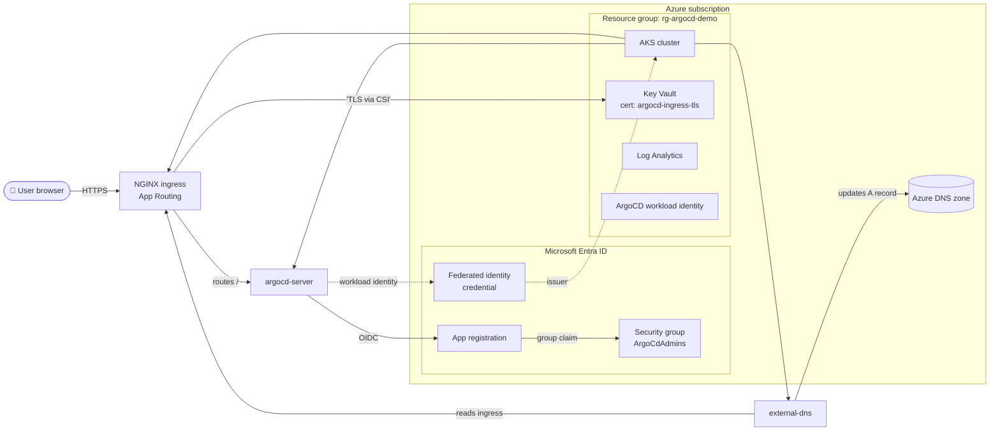
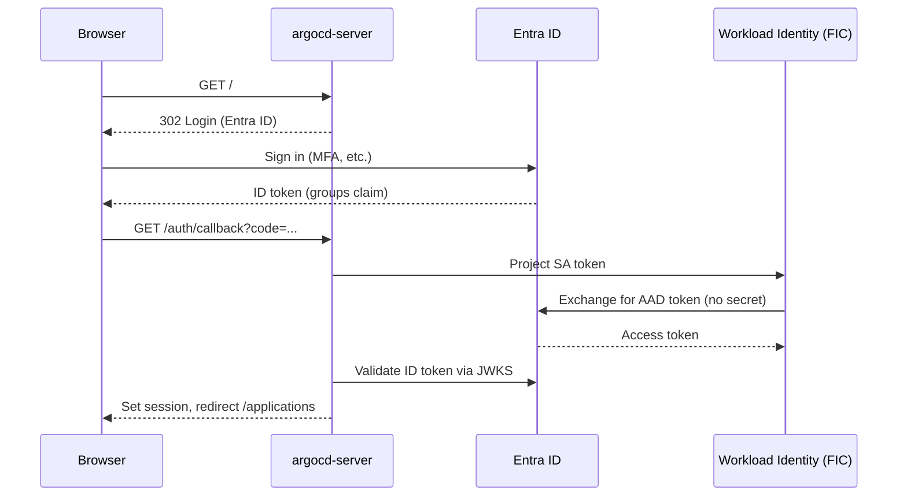

# AKS Argo CD Extension with Microsoft Entra SSO

End-to-end Terraform automation that deploys [Argo CD](https://argo-cd.readthedocs.io/) on Azure Kubernetes Service (AKS) using the **`Microsoft.ArgoCD` cluster extension**, with Microsoft Entra ID single sign-on, group-based RBAC, TLS from Azure Key Vault, and automatic DNS via the App Routing add-on — all in a single `./deploy.sh` invocation.

> The Argo CD AKS extension is currently in **public preview**. Schema keys (`sso.*`, `configs.cm.*`, etc.) may change between releases.

### References

- [AKS / Arc tutorial – Use GitOps with Argo CD](https://learn.microsoft.com/azure/azure-arc/kubernetes/tutorial-use-gitops-argocd)
- [AKS blog – Argo CD extension with Microsoft Entra (Apr 2026)](https://blog.aks.azure.com/2026/04/22/argocd-extension-with-microsoft-entra)
- [App Routing add-on – Configure Key Vault TLS](https://learn.microsoft.com/azure/aks/app-routing-dns-ssl)
- [Argo CD OIDC config reference](https://argo-cd.readthedocs.io/en/stable/operator-manual/user-management/microsoft/)

---

## 🏗️ Architecture



### Request flow at runtime

1. User hits `https://argocd.example.com/` — DNS resolves to the public IP of the NGINX service (populated by `external-dns` from the ingress).
2. NGINX terminates TLS using the Key Vault cert (mounted via Secrets Store CSI) and proxies to `argocd-server`.
3. `argocd-server` redirects to Entra ID for sign-in. The user authenticates and is returned to `/auth/callback` with an ID token containing the `groups` claim.
4. `argocd-server` validates the token using its **workload identity** (federated SA token → Entra token) — no client secret stored anywhere.
5. The RBAC config maps the `ArgoCdAdmins` group object ID to the `role:admin` policy.

---

## 📁 Repository layout

```
AKS-ArgoCD-Extension/
├── README.md                               # This file
├── deploy.sh                               # Unified deploy / destroy entrypoint
├── terraform/
│   ├── providers.tf                        # azurerm / azuread / azapi / random / time
│   ├── variables.tf                        # All tunables (DNS zone, cert, admin group...)
│   ├── main.tf                             # Root – RG, Log Analytics, role assignments, module calls
│   ├── outputs.tf                          # Connection info & resource IDs
│   ├── terraform.tfvars.example
│   └── modules/
│       ├── aks/                            # AKS cluster + App Routing + CSI + Cilium
│       ├── keyvault/                       # Key Vault, cert import, role assignments
│       ├── entra/                          # Entra ID app, SP, federated identity, admin group
│       └── argocd-extension/               # Microsoft.ArgoCD cluster extension (via azapi)
└── k8s/
    ├── argocd-ingress.yaml                 # Ingress for argocd-server (App Routing class)
    ├── argocd-rbac-cm.yaml                 # Reference RBAC ConfigMap (also set by extension)
    ├── argocd-workload-identity.yaml       # Reference SA annotations (set by extension)
    └── sample-application.yaml             # Demo Argo CD Application (guestbook)
```

### Module responsibilities

| Module | Manages | Key resources |
|---|---|---|
| `modules/aks` | AKS cluster + addons | `azurerm_kubernetes_cluster` with App Routing (`web_app_routing`), Secrets Store CSI (`key_vault_secrets_provider`), Cilium dataplane, workload identity + OIDC issuer, OMS agent, user node pool |
| `modules/keyvault` | TLS cert storage | `azurerm_key_vault` (RBAC mode), `azurerm_key_vault_certificate` imported from PFX, role assignments for deployer (`Key Vault Certificates Officer`) and App Routing identity (`Key Vault Certificate User`) |
| `modules/entra` | SSO identity | `azuread_application` (with `groups` claim, redirect URIs, Graph permissions), `azuread_service_principal`, pre-consented delegated permissions, `azuread_application_federated_identity_credential` for `argocd-server` SA, admin security group + auto-membership of the deployer |
| `modules/argocd-extension` | Argo CD itself | `azapi_resource` for `Microsoft.KubernetesConfiguration/extensions` with `extensionType = Microsoft.ArgoCD`. Sets ingress class, hostname, OIDC config (workload-identity SSO, no client secret), RBAC policy mapping the admin group |

### Root `main.tf` also creates

- Resource group + Log Analytics workspace
- `azurerm_user_assigned_identity` for ArgoCD pods + federated identity credentials for `argocd-server`, `argocd-application-controller`, `argocd-repo-server`
- Role assignments for the App Routing identity:
  - `DNS Zone Contributor` on the specific zone (for record CRUD)
  - `Reader` on the DNS zone resource group (for zone enumeration by `external-dns`)
- `time_sleep` resource (90 s) so Terraform waits for RBAC propagation before signaling completion

---

## 🧱 Resources created

| Resource | Name (default) | Notes |
|---|---|---|
| Resource group | `rg-argocd-demo` | Container for all demo resources |
| AKS cluster | `aks-argocd-demo` | Workload Identity + OIDC, Cilium overlay, App Routing add-on, Secrets Store CSI, Standard tier |
| Node resource group | `rg-argocd-demo-nodes` | Custom name (not the AKS default `MC_*`) |
| User node pool | `user` | 2× `Standard_D4ds_v5`, ephemeral OS disk, AzureLinux |
| Log Analytics workspace | `log-argocd-demo` | 30-day retention, PerGB2018 SKU |
| Key Vault | `kv-argocd-demo-<rand>` | RBAC authorization, soft-delete 7d, purge protection off |
| Key Vault certificate | `argocd-ingress-tls` | Imported from local `.pfx` |
| User-assigned managed identity | `id-argocd-argocd-demo` | For ArgoCD pods (federated with 3 SAs) |
| Entra ID app | `argocd-argocd-demo` | OIDC IdP — workload identity SSO, no client secret |
| Entra ID security group | `ArgoCdAdmins` | Deployer added as initial member |
| Argo CD cluster extension | `argocd` | Installed into `argocd` namespace |

The custom **node resource group** `rg-<project>-<env>-nodes` follows the repository's AKS naming convention.

---

## ✅ Prerequisites

### Required tools

| Tool | Min version | Install |
|---|---|---|
| Terraform | `>= 1.6` | [terraform.io](https://developer.hashicorp.com/terraform/install) |
| Azure CLI | `>= 2.60` | `brew install azure-cli` |
| kubectl | latest | `az aks install-cli` |
| `k8s-extension` CLI extension | latest | `az extension add --name k8s-extension` |
| `aks-preview` CLI extension | latest | `az extension add --name aks-preview` |
| OpenSSL (for cert prep, optional) | any | usually pre-installed |

### Azure permissions

The identity running `terraform apply` needs:

| Permission | Scope | Why |
|---|---|---|
| `Contributor` | Subscription or RG | Create AKS, Key Vault, Log Analytics, managed identities |
| `Role Based Access Control Administrator` (or `User Access Administrator`) | Subscription or RG | Create role assignments for the App Routing identity, Key Vault access, DNS zone access |
| `Application Administrator` (or `Cloud Application Administrator`) | Entra ID tenant | Register the SSO application |
| Owner-equivalent on the DNS zone RG | DNS zone RG | Grant `DNS Zone Contributor` to the App Routing identity |

### Required pre-existing Azure resources

1. **Public Azure DNS zone** you control (e.g. `example.com`) — already delegated from the registrar.
2. **PFX certificate** covering the Argo CD FQDN:
   - Wildcard (`*.example.com`) **or** single-SAN (`argocd.example.com`)
   - Must be from a **publicly trusted CA** (DigiCert, Let's Encrypt, GoDaddy, etc.). Self-signed = `ERR_CERT_AUTHORITY_INVALID` in the browser.
   - Must be exportable with the **private key** included.
   - Convert from PEM to PFX if needed:
     ```bash
     openssl pkcs12 -export -out wildcard.pfx \
       -inkey privkey.pem -in fullchain.pem
     ```

### Azure resource provider registration

```bash
az provider register --namespace Microsoft.KubernetesConfiguration
az provider register --namespace Microsoft.ContainerService
az provider register --namespace Microsoft.OperationalInsights

# Verify
az provider show -n Microsoft.KubernetesConfiguration --query registrationState -o tsv
```

---

## ⚙️ Configuration

### Required variables

Create `terraform/terraform.tfvars`:

```hcl
dns_zone_name           = "example.com"
dns_zone_resource_group = "rg-dns-zones"
argocd_hostname         = "argocd.example.com"
certificate_pfx_path    = "./star_example_com.pfx"
# Only if the pfx has a password:
# certificate_pfx_password = "secret"
```

### All variables

| Variable | Required | Default | Description |
|---|---|---|---|
| `dns_zone_name` | ✅ | — | Existing Azure DNS zone name (e.g. `example.com`) |
| `dns_zone_resource_group` | ✅ | — | RG containing the DNS zone |
| `argocd_hostname` | ✅ | — | FQDN for Argo CD (must be a record under `dns_zone_name`) |
| `certificate_pfx_path` | ✅ | — | Path to PFX file (relative to `terraform/` directory) |
| `certificate_pfx_password` |  | `""` | Password for the PFX. Empty if none. |
| `project` |  | `argocd` | Short name used in resource naming |
| `environment` |  | `demo` | Environment suffix (`dev`, `demo`, `prod`) |
| `location` |  | `northeurope` | Azure region |
| `kubernetes_version` |  | `1.34` | AKS K8s version |
| `node_count` |  | `2` | System node pool size |
| `node_vm_size` |  | `Standard_D4ds_v5` | System node VM size |
| `user_node_pool_name` |  | `user` | User node pool name |
| `user_node_pool_vm_size` |  | `Standard_D4ds_v5` | User node VM size |
| `user_node_pool_node_count` |  | `2` | User node pool size |
| `extra_redirect_uris` |  | `[]` | Additional reply URLs for the Entra app (e.g. for `argocd-cli` SSO) |

### Terraform outputs

After `terraform apply`:

| Output | Purpose |
|---|---|
| `resource_group_name` | RG of the demo |
| `aks_cluster_name` | AKS cluster name |
| `aks_get_credentials_command` | Copy-paste `az aks get-credentials` |
| `key_vault_name` | KV name |
| `key_vault_certificate_uri` | Versionless cert URI (used in NginxIngressController patch) |
| `argocd_hostname` | The FQDN you configured |
| `argocd_entra_application_client_id` | Entra app client ID |
| `argocd_entra_application_object_id` | Entra app object ID |
| `argocd_entra_application_tenant_id` | Tenant ID |
| `argocd_admin_group_object_id` | Object ID of `ArgoCdAdmins` group |
| `argocd_initial_admin_password_command` | One-liner to read bootstrap admin password |
| `argocd_extension_id` | Full resource ID of the cluster extension |
| `argocd_workload_identity_client_id` | UAMI client ID used by ArgoCD pods |
| `argocd_workload_identity_principal_id` | UAMI principal ID (for granting it access to ACR, KV, etc.) |

---

## 🚀 Deploy

```bash
cd AKS-ArgoCD-Extension

# 1. Login to Azure
az login
az account set --subscription "<your-subscription>"

# 2. Create terraform.tfvars (see Configuration above)

# 3. Deploy
./deploy.sh
```

### What `deploy.sh` does, step by step

| # | Step | What happens |
|---|---|---|
| 1 | `terraform init` | Downloads providers and module dependencies |
| 2 | `terraform apply` | Provisions all Azure resources (~15 min). The `time_sleep.dns_rbac_propagation` resource adds 90 s at the end to wait for RBAC propagation. |
| 3 | Read outputs | Captures RG, cluster, KV URI, hostname |
| 4 | `az aks get-credentials` | Fetches kubeconfig |
| 5 | Wait for extension | Polls `az k8s-extension show` until `provisioningState = Succeeded` |
| 6 | `kubectl rollout status` | Waits for `argocd-server` deployment ready |
| 7 | Restart `external-dns` | Forces a fresh AAD token after RBAC propagation |
| 8 | Wait for `NginxIngressController` CR | `kubectl wait --for=condition=Available` |
| 9 | Patch `NginxIngressController` | Adds `spec.defaultSSLCertificate.keyVaultURI` — mirrors what the Portal does when you enable HTTPS on App Routing |
| 10 | Wait for KV cert sync | Polls until `app-routing-system/keyvault-nginx-default` secret exists |
| 11 | Apply ingress | `k8s/argocd-ingress.yaml` with hostname substituted |
| 12 | Print NGINX public IP | Verify DNS A record (auto-created by `external-dns`) |
| 13 | Apply sample Application | `k8s/sample-application.yaml` (guestbook) |
| 14 | Print bootstrap admin password | Use it once, then sign in via SSO and rotate or disable |

### Tear down

```bash
./deploy.sh --destroy
```

> The DNS zone and any DNS records created manually outside Terraform are left untouched. The `external-dns`-managed A record will be cleaned up automatically as the ingress is deleted.

---

## 🔐 SSO sign-in

### How the SSO flow works



### Group-based RBAC

The `argocd-rbac-cm` is set by the extension to:

```
g, <argocd_admin_group_object_id>, role:admin
policy.default: role:readonly
scopes: [groups]
```

- Members of `ArgoCdAdmins` get full `admin` role
- Everyone else who can sign in gets `readonly`
- The deployer is automatically added to the group at apply time

### Manage group membership

```bash
GROUP_ID=$(cd terraform && terraform output -raw argocd_admin_group_object_id)

# Add a user
az ad group member add --group $GROUP_ID --member-id <user-object-id>

# List members
az ad group member list --group $GROUP_ID -o table
```

### Tenant admin consent for Graph permissions

The Entra app requests delegated `User.Read`, `openid`, `profile`, `email`. Terraform pre-grants these via `azuread_service_principal_delegated_permission_grant` so end-users won't see a consent prompt. If you add additional scopes that require admin consent, run:

```bash
APP_OBJ=$(cd terraform && terraform output -raw argocd_entra_application_object_id)
az ad app permission admin-consent --id $APP_OBJ
```

---

## ✅ Verifying the deployment

```bash
# Cluster + nodes
kubectl get nodes -o wide

# Argo CD components
kubectl -n argocd get pods
kubectl -n argocd get ingress argocd-server

# App Routing
kubectl -n app-routing-system get pods
kubectl get nginxingresscontroller default \
  -o jsonpath='{.spec.defaultSSLCertificate.keyVaultURI}{"\n"}'

# Cert synced from Key Vault
kubectl -n app-routing-system get secret keyvault-nginx-default \
  -o jsonpath='{.data.tls\.crt}' | base64 -d | \
  openssl x509 -noout -subject -issuer -dates

# Workload identity SAs annotated correctly
kubectl -n argocd get sa argocd-server -o yaml | grep azure.workload.identity

# Extension status
RG=$(cd terraform && terraform output -raw resource_group_name)
CLUSTER=$(cd terraform && terraform output -raw aks_cluster_name)
az k8s-extension show --cluster-type managedClusters \
  --cluster-name $CLUSTER --resource-group $RG --name argocd \
  --query "{state:provisioningState,version:version}" -o table

# DNS resolves to the NGINX public IP
HOST=$(cd terraform && terraform output -raw argocd_hostname)
NGINX_IP=$(kubectl -n app-routing-system get svc nginx \
  -o jsonpath='{.status.loadBalancer.ingress[0].ip}')
echo "Expected: $NGINX_IP"; dig +short $HOST
```

---

## 🧹 Clean up

```bash
./deploy.sh --destroy
```

`terraform destroy` removes:
- Argo CD extension
- AKS cluster (and its node resource group)
- Key Vault (with `purge_soft_delete_on_destroy = true` — fully purged on destroy)
- Entra ID application, service principal, security group
- All role assignments
- Log Analytics workspace

The pre-existing DNS zone is **not** touched. The A record created by `external-dns` is removed automatically when the ingress is deleted.

---

## 📝 Design notes

- **No client secret stored anywhere.** The Argo CD extension uses workload identity for SSO via the `azure.useWorkloadIdentity: true` setting in the OIDC config, exchanging the projected SA token for an Entra token through the federated identity credential.
- **Argo CD config keys with dots are escaped.** In the `Microsoft.KubernetesConfiguration` extension settings, the `configs.cm.oidc.config` key is sent as `configs.cm.oidc\\.config` because the extension uses dots as the path separator.
- **Extension preview schema.** If the `Microsoft.ArgoCD` extension schema changes (new keys, renamed keys), update `modules/argocd-extension/main.tf` accordingly. The `ignore_changes = [body]` lifecycle keeps Terraform from fighting in-place updates done by the extension manager.
- **Terraform state contains sensitive values** (federated identity issuer, app object IDs, KV cert URI). Use a remote backend with state encryption (Azure Storage + CMK, Terraform Cloud, etc.) for non-throwaway environments.
- **`local_account_disabled = false`** on the cluster — kept enabled so the bootstrap `argocd-initial-admin-secret` and break-glass `kubectl` access work. Disable in production.
- **Single replica** per Argo CD component (`server`, `repoServer`, `controller`) — this is a demo, not HA. Increase `*.replicas` in the extension config for production.

---

## ⚠️ Known issues & deployment tips

Real issues encountered during development. Read before deploying.

### 1. TLS shows `ERR_CERT_AUTHORITY_INVALID` — nginx using self-signed cert

**Root cause:** The App Routing nginx controller ships with a self-signed fallback certificate. It only switches to your real cert after the `NginxIngressController` CR is patched with `spec.defaultSSLCertificate.keyVaultURI`.

**How it works (and how the Portal does it):**  
The Azure Portal's _App Routing → HTTPS → select Key Vault_ flow patches this same CR. `deploy.sh` reproduces that exact step:

```bash
kubectl patch nginxingresscontroller default --type=merge \
  -p '{"spec":{"defaultSSLCertificate":{"keyVaultURI":"<kv-cert-uri>"}}}'
```

The App Routing operator then creates a `SecretProviderClass`, the Secrets Store CSI driver syncs the cert from Key Vault into a `kubernetes.io/tls` Secret in `app-routing-system`, and nginx restarts with `--default-ssl-certificate=app-routing-system/keyvault-nginx-default`.

**Do not** add `kubernetes.azure.com/tls-cert-keyvault-uri` as a per-ingress annotation — that is a different, per-ingress mechanism and is not needed when the default cert is set at the controller level.

**Diagnose:**
```bash
kubectl get nginxingresscontroller default -o jsonpath='{.spec.defaultSSLCertificate}'
kubectl -n app-routing-system get secret keyvault-nginx-default
kubectl -n app-routing-system get deploy nginx \
  -o jsonpath='{.spec.template.spec.containers[0].args}' | python3 -m json.tool | grep ssl
```

---

### 2. `kubectl patch nginxingresscontroller` fails on a fresh cluster

**Root cause:** The `NginxIngressController default` CR is created asynchronously by the App Routing addon after the cluster becomes ready. Running the patch immediately after `az aks get-credentials` can hit `not found`.

**Fix:** `deploy.sh` waits with:
```bash
kubectl wait nginxingresscontroller default --for=condition=Available --timeout=5m
```

---

### 3. Secrets Store CSI Driver must be explicitly enabled in Terraform

**Root cause:** `az aks approuting update --attach-kv` implicitly enables the Secrets Store CSI driver. Terraform's `azurerm_kubernetes_cluster` does **not** enable it by default — the App Routing operator silently fails to mount the KV cert without it (CSI volume mount errors in pod events).

**Fix:** The `key_vault_secrets_provider` block in `modules/aks/main.tf` enables it:
```hcl
key_vault_secrets_provider {
  secret_rotation_enabled  = true
  secret_rotation_interval = "2m"
}
```

**Diagnose:**
```bash
kubectl -n kube-system get pods -l 'app in (secrets-store-csi-driver,csi-secrets-store-provider-azure)'
# Should show aks-secrets-store-csi-driver-* DaemonSet pods
```

---

### 4. App Routing identity needs `Key Vault Certificate User`, not `Key Vault Secrets User`

**Root cause:** `az aks approuting update --attach-kv` grants `Key Vault Certificate User` (not `Key Vault Secrets User`) to the App Routing managed identity. `Key Vault Certificate User` permits `getSecret` on the backing secret of a certificate, which is how the CSI driver retrieves the private key. `Key Vault Secrets User` alone is insufficient when the KV object is a certificate.

**Where it's configured:** `modules/keyvault/main.tf`:
```hcl
resource "azurerm_role_assignment" "approuting_kv_cert_user" {
  scope                = azurerm_key_vault.this.id
  role_definition_name = "Key Vault Certificate User"
  principal_id         = var.app_routing_object_id
}
```

**Diagnose (after a failed sync):**
```bash
RG=$(cd terraform && terraform output -raw resource_group_name)
CLUSTER=$(cd terraform && terraform output -raw aks_cluster_name)
KV=$(cd terraform && terraform output -raw key_vault_name)
APP_OID=$(az aks show -g $RG -n $CLUSTER \
  --query 'ingressProfile.webAppRouting.identity.objectId' -o tsv)
KV_ID=$(az keyvault show -n $KV --query id -o tsv)
az role assignment list --assignee $APP_OID --scope $KV_ID -o table
```

---

### 5. `external-dns` gets 403 on DNS zones — needs Reader on the resource group

**Root cause:** `external-dns` lists DNS zones at the **resource group** level before accessing the specific zone. `DNS Zone Contributor` scoped to the zone alone does not grant `Microsoft.Network/dnsZones/read` at the RG level, causing a 403.

**Fix:** Two role assignments in `main.tf`:
```hcl
resource "azurerm_role_assignment" "approuting_dns_zone_contributor" {
  role_definition_name = "DNS Zone Contributor"
  scope                = data.azurerm_dns_zone.this.id
  ...
}

resource "azurerm_role_assignment" "approuting_dns_rg_reader" {
  role_definition_name = "Reader"
  scope                = data.azurerm_resource_group.dns_zones.id
  ...
}
```

**Diagnose:**
```bash
kubectl -n app-routing-system logs deploy/external-dns | grep -iE 'forbid|403|unauthorized'
```

---

### 6. RBAC role assignments take time to propagate

**Root cause:** Azure RBAC assignments can take 30–90 s to propagate. `external-dns` starts immediately after the cluster is ready and crashes with 403 if it queries the DNS zone before the role assignments are active.

**Fix:** A `time_sleep` resource in `main.tf` waits 90 s after all DNS role assignments are created before Terraform signals completion. `deploy.sh` also restarts `external-dns` after kubeconfig is fetched to force a fresh token:
```bash
kubectl -n app-routing-system rollout restart deployment external-dns
```

---

### 7. Entra ID Graph permissions require tenant-wide admin consent

**Root cause:** Some delegated Graph scopes (e.g. `GroupMember.Read.All` if you add it) require Entra ID admin consent — Terraform creates the permission grant in the app registration but cannot consent on behalf of the tenant.

**Fix:** This repo only uses `User.Read` / `openid` / `profile` / `email` which are pre-consented by Terraform. If you extend the app with admin-only scopes:
```bash
APP_OBJ=$(cd terraform && terraform output -raw argocd_entra_application_object_id)
az ad app permission admin-consent --id $APP_OBJ
```

---

### 8. Argo CD extension stuck in `Updating` for > 30 minutes

**Root cause:** The extension creates ~30 K8s resources via Helm and waits for `argocd-server` rollout. If the cluster is under-provisioned or the system node pool is full, pods can't schedule.

**Diagnose:**
```bash
az k8s-extension show --cluster-type managedClusters \
  --cluster-name $CLUSTER --resource-group $RG --name argocd \
  --query "statuses" -o jsonc
kubectl -n argocd describe pod -l app.kubernetes.io/name=argocd-server
kubectl -n argocd get events --sort-by=.lastTimestamp | tail -20
```

**Fix:** Increase `node_count` / `node_vm_size` in `terraform.tfvars` and re-apply, or scale the existing pool with `az aks scale`.

---

### 9. Workload identity SSO returns "user not found" but bootstrap admin works

**Root cause:** The `groups` claim in the Entra ID token is empty because (a) the user is not a member of the security group, or (b) the app's `group_membership_claims = ["ApplicationGroup"]` requires the group to be explicitly assigned to the app via `azuread_app_role_assignment` (this repo does this), or (c) the user signed in before being added to the group and the token is cached.

**Diagnose:**
```bash
# Decode the user's ID token at https://jwt.ms after signing in
# Check that the "groups" array contains the admin group object ID

GROUP_ID=$(cd terraform && terraform output -raw argocd_admin_group_object_id)
az ad group member check --group $GROUP_ID --member-id <your-user-object-id>
```

**Fix:**
- Add the user to the `ArgoCdAdmins` group
- Sign out completely and back in to refresh tokens
- For service principals/automation, use Argo CD's API token instead of group-based SSO

---

### 10. `terraform destroy` leaves Key Vault in soft-deleted state

**Root cause:** Even with `soft_delete_retention_days = 7`, Azure won't actually purge the KV unless the provider is told to.

**Fix:** The provider config in `providers.tf` sets:
```hcl
provider "azurerm" {
  features {
    key_vault {
      purge_soft_delete_on_destroy    = true
      recover_soft_deleted_key_vaults = true
    }
  }
}
```

If you destroyed before this was set, manually purge:
```bash
az keyvault purge --name <kv-name> --location <region>
```

---

## 💰 Approximate cost

A back-of-envelope estimate for the default sizing in North Europe (USD/month):

| Component | Qty | Est. monthly |
|---|---|---|
| AKS Standard tier | 1 cluster | $73 |
| System node pool (`Standard_D4ds_v5`) | 2 × Linux | $280 |
| User node pool (`Standard_D4ds_v5`) | 2 × Linux | $280 |
| Log Analytics ingestion | minimal | $5–15 |
| Public Load Balancer + outbound IP | 1 | $20 |
| Key Vault | minimal ops | $1 |
| **Total** |  | **~$660/month** |

**To reduce cost for a demo:**
- Set `user_node_pool_node_count = 0` and run everything on the system pool
- Use `Standard_B4ms` instead of `D4ds_v5` (`node_vm_size` / `user_node_pool_vm_size`)
- Stop the cluster when idle: `az aks stop -g $RG -n $CLUSTER`

---

## 🔒 Security considerations

- **Disable `local_account_disabled = true`** in production and use AAD-integrated AKS auth exclusively
- **Use a remote Terraform backend** with state encryption — state contains the Entra app object IDs and FIC issuer URLs
- **Rotate the bootstrap admin password** immediately, or delete the secret entirely after first SSO login:
  ```bash
  kubectl -n argocd delete secret argocd-initial-admin-secret
  ```
- **Restrict Key Vault network access** for production (currently the demo allows all public access). Consider Private Endpoint + AKS pod-to-KV traffic via VNet integration.
- **Enable Microsoft Defender for Containers** on the cluster for runtime threat detection
- **Use a SAN cert specific to the hostname** instead of a tenant-wide wildcard in production
