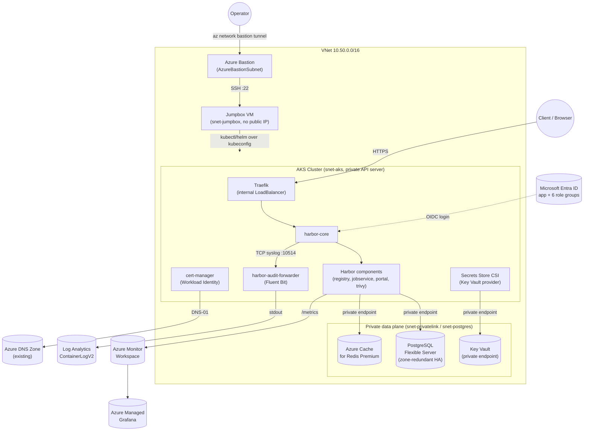

# Harbor on AKS — Production Architecture (Terraform Modules + Traefik + cert-manager + Entra ID SSO)

A production-shaped Harbor container registry deployment on AKS: a **private AKS cluster**
reachable only through **Azure Bastion** and a jumpbox, dedicated subnets for every tier,
an external PostgreSQL Flexible Server and Azure Cache for Redis Premium behind private
endpoints, Key Vault-backed secrets synced via the Secrets Store CSI driver, Microsoft
Entra ID OIDC login with per-role security groups, and Azure Monitor + Managed Grafana
observability — all provisioned through composable Terraform modules.

It is the production-oriented companion to the simpler [AKS-Harbor-Registry-Demo](../AKS-Harbor-Registry-Demo),
which uses Harbor's bundled internal Postgres/Redis and local auth only. Use this demo
when you want to see what a hardened, defense-in-depth Harbor deployment looks like end
to end.

## 📋 Overview

| Concern | How it's covered |
|---|---|
| Container registry | Harbor Helm chart with **external** PostgreSQL Flexible Server + Azure Cache for Redis Premium (no bundled DB/cache), Azure Files Premium ZRS NFS for registry storage |
| Cluster access | AKS API server has **no public endpoint** (`private_cluster_enabled = true`); reached only via **Azure Bastion** tunneling SSH to a jumpbox VM inside the VNet — see [Private cluster access](#-private-cluster-access-via-azure-bastion) |
| Networking | Dedicated VNet with one subnet per tier — AKS, PostgreSQL, Private Link, `AzureBastionSubnet`, and a jumpbox subnet — plus private DNS zones for PostgreSQL, Redis, Key Vault, and the AKS control plane |
| Secrets | Azure Key Vault (RBAC, private endpoint, purge protection) — synced into Kubernetes Secrets via the AKS-managed Secrets Store CSI driver (Workload Identity, no stored credentials) |
| Ingress | [Traefik](https://traefik.io/traefik) (Helm) + `IngressRoute`/`Middleware` — HTTPS with HTTP→HTTPS redirect and HSTS, mirroring the registry demo's proven pattern |
| TLS | cert-manager `Certificate` (`harbor-tls`) issued by a Let's Encrypt production `ClusterIssuer` via **Azure DNS DNS-01**, authenticated with Azure Workload Identity (no client secret) |
| Audit logs | Fluent Bit sidecar (`harbor-audit-forwarder`) re-emits Harbor's audit syslog stream to stdout → Container Insights → Log Analytics `ContainerLogV2`. **Must be `Ready` before Harbor installs** — `harbor-core` dials it at startup and exits if unreachable |
| Metrics | Harbor Prometheus metrics → Azure Monitor managed Prometheus (DCE/DCR) → Azure Managed Grafana |
| SSO | Microsoft Entra ID OIDC login — app registration/SPN + client secret + 6 Harbor role groups, fully Terraform-managed in `modules/identity` (see [Microsoft Entra ID OIDC SSO](#-microsoft-entra-id-oidc-sso)) |
| Node pools | Dedicated `system` and `harbor` node pools, both zone-redundant and autoscaling |

## 🏗️ Architecture



## 🌐 Subnet plan

VNet `10.50.0.0/16`, one subnet per tier so NSGs and route tables can be scoped narrowly:

| Subnet | CIDR | Purpose |
|---|---|---|
| `snet-aks` | `10.50.0.0/20` | AKS nodes (pod IPs come from the CNI overlay range, not this subnet) |
| `snet-postgres` | `10.50.16.0/24` | Delegated to `Microsoft.DBforPostgreSQL/flexibleServers` |
| `snet-privatelink` | `10.50.17.0/24` | Private endpoints for Redis and Key Vault |
| `AzureBastionSubnet` | `10.50.18.0/26` | Azure Bastion (name is fixed by the service) |
| `snet-jumpbox` | `10.50.18.64/28` | Jumpbox VM — no public IP, SSH allowed only from `AzureBastionSubnet` |

Private DNS zones (all linked to the VNet above): `privatelink.postgres.database.azure.com`, `privatelink.redis.azure.net`, `privatelink.vaultcore.azure.net`, plus the AKS-managed `privatelink.<region>.azmk8s.io` zone created automatically by `private_dns_zone_id = "System"`.

## 🔐 Private cluster access via Azure Bastion

The AKS API server has `private_cluster_enabled = true` — it has no public IP and is only
reachable from inside the VNet. There is no VPN or peering back to your laptop, so
`deploy.sh` reaches the cluster by tunneling through Azure Bastion to a jumpbox VM that
lives in the same VNet:

1. `deploy.sh` runs `terraform apply`, renders every manifest locally, and fetches a
   kubeconfig with `az aks get-credentials` (this call only talks to the ARM control
   plane, so it works from anywhere — fetching credentials for a private cluster doesn't
   require network access to it).
2. It opens `az network bastion tunnel` (a local TCP forward to the jumpbox's SSH port),
   `scp`s the rendered manifests + kubeconfig to the jumpbox, then `ssh`es in and runs
   [`kubernetes-manifests/remote-deploy.sh`](kubernetes-manifests/remote-deploy.sh), which
   does the actual `helm`/`kubectl` work using the shipped kubeconfig.
3. The tunnel is closed automatically when the script exits.

By default the jumpbox uses a **password** (auto-generated by Terraform if you don't set
`jumpbox_admin_password`) — it's the simplest option to get started:

```bash
terraform -chdir=terraform output -raw jumpbox_admin_password
```

`deploy.sh` uses this password automatically via `sshpass` (install it, e.g.
`brew install hudochenkov/sshpass/sshpass` on macOS). **SSH key auth is more secure** and
recommended if you'll use the jumpbox more than once — set it instead:

```bash
ssh-keygen -t ed25519 -f ./harbor-jumpbox-key -N ""
# put the .pub contents in terraform.tfvars as jumpbox_ssh_public_key, then re-apply
export JUMPBOX_SSH_KEY="$(pwd)/harbor-jumpbox-key"   # deploy.sh prefers this over the password when set
```

To poke around interactively instead: `az network bastion ssh --name <bastion_name> --resource-group <rg> --target-resource-id <jumpbox_vm_id> --auth-type password --username azureuser` (or `--auth-type ssh-key --ssh-key ./harbor-jumpbox-key` if you set one up). The jumpbox's cloud-init already installs `az`, `kubectl`, and `helm`.

## 📁 Contents

```text
AKS-Harbor-Production-Demo/
├── deploy.sh
├── cleanup.sh
├── terraform/
│   ├── versions.tf
│   ├── variables.tf
│   ├── main.tf                 # wires every module below via `module` blocks
│   ├── outputs.tf
│   ├── terraform.tfvars.example
│   └── modules/
│       ├── network/            # VNet, one subnet per tier, private DNS zones
│       ├── aks/                # private AKS cluster + harbor node pool + Key Vault CSI
│       ├── bastion/             # Azure Bastion + jumpbox VM (only path to the private API server)
│       ├── identity/           # cert-manager Workload Identity + Entra ID OIDC/SSO
│       ├── postgres/           # PostgreSQL Flexible Server (private, zone-redundant)
│       ├── redis/               # Azure Cache for Redis Premium (private endpoint)
│       ├── keyvault/            # Key Vault + all Harbor secrets
│       └── alerts/              # variables only today — not yet wired into main.tf
└── kubernetes-manifests/
    ├── namespace.yaml
    ├── cluster-issuer.yaml.tpl          # cert-manager ClusterIssuer (envsubst template)
    ├── audit-log-forwarder.yaml         # Fluent Bit ConfigMap+Deployment+Service
    ├── secretproviderclass.yaml.tpl     # Key Vault CSI SecretProviderClass
    ├── keyvault-secret-sync.yaml        # forces the CSI driver to materialize K8s Secrets
    ├── storageclass-azurefile-zrs-nfs.yaml
    ├── harbor-values.yaml.tpl           # Harbor Helm values (envsubst template)
    ├── harbor-certificate.yaml.tpl      # cert-manager Certificate
    ├── harbor-ingress-route.yaml.tpl    # Traefik IngressRoute + Middleware
    └── remote-deploy.sh                 # runs on the jumpbox: helm/kubectl against the private cluster
```

Every module under `terraform/modules/` (except `alerts`, which is only a
`variables.tf` stub) is wired into the root `main.tf` via `module` blocks —
`terraform apply` provisions the full architecture described above, not just
the AKS cluster.

## ✅ Prerequisites

- Azure CLI (`az`) logged in with Contributor + User Access Administrator (or equivalent) on the target subscription, plus the `bastion` az CLI extension (`deploy.sh` installs it automatically if missing)
- An **existing** Azure DNS zone already delegated to Azure DNS (this demo reads it as a data source; it does not create or delegate a zone)
- Microsoft Entra ID permissions to create app registrations, create/manage security groups, and grant admin consent — only required while `enable_oidc_auth = true` (the default)
- `sshpass` for the jumpbox's default password auth (e.g. `brew install hudochenkov/sshpass/sshpass`) — or an SSH keypair (`ssh-keygen -t ed25519 -f ./harbor-jumpbox-key -N ""`) set as `jumpbox_ssh_public_key`, which is the more secure option
- Terraform >= 1.6.0
- `kubectl`, `helm` (>= 3.8), `envsubst` (part of `gettext`), `ssh`/`scp`, `nc`

## 🚀 Quick Start

```bash
cd AKS-Harbor-Production-Demo/terraform
cp terraform.tfvars.example terraform.tfvars
# edit terraform.tfvars: dns_zone_name, dns_zone_resource_group, acme_email
# (optional but more secure: set jumpbox_ssh_public_key too)
cd ..
./deploy.sh
```

`deploy.sh` runs, in order:
1. `terraform apply` — resource group, VNet with one subnet per tier + private DNS zones, a **private** AKS cluster (Workload Identity + OIDC issuer, joined to its own VNet subnet, Container Insights, managed Prometheus, Key Vault Secrets Provider), Azure Bastion + a jumpbox VM, the cert-manager identity + federated credential + DNS role assignment, PostgreSQL Flexible Server, Redis Premium, Key Vault with all Harbor secrets, Azure Managed Grafana, and (if `enable_oidc_auth = true`) the Entra ID app/SPN, client secret, and 6 Harbor role groups.
2. Fetches a kubeconfig for the private cluster and renders every manifest locally.
3. Opens an Azure Bastion tunnel to the jumpbox, copies the rendered manifests over, and runs the remainder of the deployment there (Traefik, cert-manager, the `letsencrypt-prod` `ClusterIssuer`, storage class, Key Vault `SecretProviderClass`, the audit-log forwarder — which must be `Ready` before Harbor installs — Harbor itself, and the `harbor-tls` `Certificate` + Traefik `IngressRoute`/`Middleware`).

### Terraform only

```bash
cd terraform
terraform init
terraform apply -var dns_zone_name=example.com -var dns_zone_resource_group=rg-dns-zones -var acme_email=you@example.com
```

## 🔎 Verification

**Harbor login:**
```bash
open "https://$(terraform -chdir=terraform output -raw harbor_fqdn)"
# admin / $(terraform -chdir=terraform output -raw harbor_admin_password)
```

**Audit logs in Log Analytics** (after logging in to Harbor at least once):
```kusto
ContainerLogV2
| where PodNamespace == "harbor" and ContainerName == "fluent-bit"
| extend Audit = parse_json(LogMessage)
| where isnotempty(Audit.log)
| project TimeGenerated, AuditEvent = tostring(Audit.log)
| order by TimeGenerated desc
```

**Metrics in Grafana:** open the endpoint from `terraform output -raw grafana_endpoint`, add an "Azure Monitor Managed Service for Prometheus" data source pointed at the Azure Monitor workspace, and run `harbor_up` in Explore.

**Private networking:** confirm PostgreSQL, Redis, and Key Vault all resolve to private IPs from inside the cluster (run from the jumpbox, or via `az network bastion ssh` into a pod's node):
```bash
kubectl run -it --rm dnsutils --image=ghcr.io/dnsutils/dnsutils --restart=Never -- \
  sh -c "nslookup $(terraform -chdir=terraform output -raw postgres_host)"
```

**Cluster access sanity check:** confirm the API server truly has no public endpoint, then confirm the jumpbox path works:
```bash
az aks show --name "$(terraform -chdir=terraform output -raw cluster_name)" \
  --resource-group "$(terraform -chdir=terraform output -raw resource_group_name)" \
  --query "apiServerAccessProfile.enablePrivateCluster"   # expect: true
```

## 🧹 Cleanup

```bash
./cleanup.sh
```

This uninstalls the Helm releases, deletes the `harbor`/`traefik`/`cert-manager` namespaces, and runs `terraform destroy`. Review the confirmation prompt before running it against a shared cluster — PostgreSQL and Key Vault have `backup_retention_days`/`purge_protection_enabled` set, so full teardown may require extra manual steps (e.g. Key Vault purge) depending on your subscription's soft-delete policy.

## 🔐 Microsoft Entra ID OIDC SSO

Terraform provisions the Entra ID identity for Harbor SSO whenever `enable_oidc_auth = true` (the default), inside `modules/identity`:

- An app registration/SPN with a Terraform-generated client secret (1-year expiry), the `https://<harbor_fqdn>/c/oidc/callback` redirect URI, and delegated Graph scopes `openid`/`profile`/`email`/`offline_access`, pre-consented tenant-wide so users skip the consent prompt.
- Six Entra ID security groups, one per Harbor role, each assigned to the app's default role so they appear in the OIDC `groups` claim:

  | Harbor role | Variable | Default group name | Scope |
  |---|---|---|---|
  | System Admin | `harbor_admin_group_name` | `harbor-admins` | Global (`oidc_admin_group`) |
  | ProjectAdmin | `harbor_projectadmin_group_name` | `harbor-projectadmins` | Per-project |
  | Maintainer | `harbor_maintainer_group_name` | `harbor-maintainers` | Per-project |
  | Developer | `harbor_developer_group_name` | `harbor-developers` | Per-project |
  | Guest (read-only) | `harbor_guest_group_name` | `harbor-guests` | Per-project |
  | Limited Guest (pull-only) | `harbor_limited_guest_group_name` | `harbor-limited-guests` | Per-project |

- Initial members of `harbor-admins` come from `harbor_admin_group_member_upns` in `terraform.tfvars` — the other 5 groups start empty and are assigned per Harbor project after creation (Harbor UI → *Project* → *Members* → *+ User Group*, using the group object ID from `terraform output`).
- **Group matching is by object ID, not name** — Entra emits group object IDs in the `groups` claim, so Harbor's `oidc_admin_group` is set to the admin group's object ID.
- To use local Harbor authentication instead, set `enable_oidc_auth = false` before the first deployment.

## 🔒 Security notes

- The AKS API server is private (`private_cluster_enabled = true`, no public FQDN); the only path in is Azure Bastion → jumpbox, and the jumpbox itself has no public IP and accepts SSH only from `AzureBastionSubnet` (NSG-enforced).
- The jumpbox defaults to password auth for convenience (Terraform auto-generates one if `jumpbox_admin_password` is left blank, and marks it `sensitive`). **SSH key auth (`jumpbox_ssh_public_key`) is more secure** — prefer it over the password for anything beyond a quick demo, since a password can be guessed/brute-forced whereas a key can't; `deploy.sh` automatically uses SSH key auth instead whenever `JUMPBOX_SSH_KEY` is set.
- Every stateful dependency (PostgreSQL, Redis, Key Vault) sits behind a private endpoint with public network access disabled; only the AKS subnet can reach them.
- Secrets never touch Terraform state as plaintext files: `harbor_admin_password`, `postgres_password`, `redis_password`, and the Harbor-internal secrets are generated with `random_password`, marked `sensitive` in outputs, and stored in Key Vault — Kubernetes only sees them via the Secrets Store CSI driver.
- cert-manager uses Azure Workload Identity (federated credential), not a client secret, scoped to `DNS Zone Contributor` on the single DNS zone.
- The Harbor OIDC client secret is a real secret (it lives in the `configureUserSettings` JSON blob, not a separate chart field); it's marked `sensitive` in Terraform outputs.
- `terraform.tfvars` is gitignored; only `terraform.tfvars.example` (placeholder values) is committed.
- **Caveat:** once `configureUserSettings` is set, all Harbor user-scope settings — including `auth_mode` — become read-only in the Harbor UI. Changing auth after this point means editing values and redeploying.

## 🛠️ Troubleshooting

| Symptom | Cause | Fix |
|---|---|---|
| `harbor-core` CrashLoopBackOff on first install | Audit-log forwarder not `Ready` yet | Check `kubectl rollout status deployment/harbor-audit-forwarder -n harbor`; re-run `helm upgrade` once it's ready |
| Certificate stuck in `Pending` | DNS-01 propagation delay, or Workload Identity misconfigured | `kubectl describe certificate harbor-tls -n harbor`; confirm the federated credential subject matches `system:serviceaccount:cert-manager:cert-manager` |
| `SecretProviderClass` doesn't create Kubernetes Secrets | `keyvault-secret-sync.yaml` pod not scheduled/running, or CSI driver identity lacks `Key Vault Secrets User` | `kubectl describe pod -n harbor -l app=harbor-secret-sync`; confirm the role assignment in `modules/keyvault` |
| Harbor can't reach PostgreSQL/Redis | Private DNS zone not linked to the AKS VNet, or NSG/firewall blocking the subnet | Verify `azurerm_private_dns_zone_virtual_network_link` in `modules/network`, and that AKS and Private Link subnets share the same VNet |
| Harbor still shows the local login form | `enable_oidc_auth = false`, or Terraform hasn't been re-applied after enabling it | Set `enable_oidc_auth = true`, re-run `terraform apply` then `./deploy.sh` |
| cert-manager gets 403 from Azure DNS | RBAC propagation delay (30–90s) | Re-check after a minute; confirm the zone-scoped `DNS Zone Contributor` role assignment exists |
| `deploy.sh` hangs at "Waiting for the tunnel to come up" | `az network bastion tunnel` failed silently (extension missing, RBAC, or wrong SKU) | Check `/tmp/harbor-bastion-tunnel.log`; confirm the Bastion `sku` is `Standard` and you have `Reader` on the Bastion resource |
| `deploy.sh` fails with "sshpass is required" | No `JUMPBOX_SSH_KEY` set and `sshpass` isn't installed | Install `sshpass` (e.g. `brew install hudochenkov/sshpass/sshpass`), or switch to the more secure SSH key option by setting `jumpbox_ssh_public_key` + `JUMPBOX_SSH_KEY` |
| `ssh`/`scp` to the jumpbox fails with `Permission denied` | Wrong password (re-run `terraform output -raw jumpbox_admin_password`), or `JUMPBOX_SSH_KEY` doesn't match the public key in `terraform.tfvars` | For password auth, re-check the output value; for SSH key auth, regenerate both together (`ssh-keygen ...`), re-apply Terraform, and re-export `JUMPBOX_SSH_KEY` before re-running `deploy.sh` |
| AKS create fails with an identity/permission error on the subnet | The `modules/aks` Network Contributor role assignment hasn't propagated yet | Re-run `terraform apply` — the module's `depends_on` normally covers this, but RBAC propagation can occasionally lag a few seconds longer than the API call |

## 📚 Further Reading

- [Harbor Helm chart](https://github.com/goharbor/harbor-helm)
- [cert-manager Azure DNS solver](https://cert-manager.io/docs/configuration/acme/dns01/azuredns/)
- [Traefik Helm chart](https://github.com/traefik/traefik-helm-chart)
- [Azure Key Vault Provider for Secrets Store CSI Driver](https://learn.microsoft.com/azure/aks/csi-secrets-store-driver)
- [Azure Bastion overview](https://learn.microsoft.com/azure/bastion/bastion-overview)
- [Create a private AKS cluster](https://learn.microsoft.com/azure/aks/private-clusters)
- [AKS-Harbor-Registry-Demo](../AKS-Harbor-Registry-Demo) — the simpler, bundled-database companion demo
