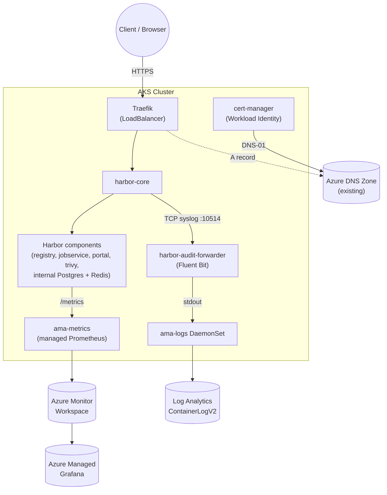

# Harbor on AKS — Terraform + Traefik + cert-manager + Azure DNS

A basic Harbor container registry install on AKS via Helm, with Terraform provisioning
exactly the Azure infrastructure needed for two companion blog posts:

- [Harbor Audit Logs in Azure Log Analytics: A Fluent Bit Bridge](https://kasunrajapakse.me/blog/harbor-audit-logs-azure-log-analytics/)
- [Monitoring Harbor with Azure Monitor and Azure Managed Grafana](https://kasunrajapakse.me/blog/monitor-harbor-azure-monitor-managed-grafana/)

Harbor is exposed over HTTPS through a Traefik ingress, with a Let's Encrypt
**production** certificate issued by cert-manager via **Azure DNS DNS-01**,
authenticated with **Azure Workload Identity** (no client secrets). The DNS
record for Harbor's hostname is created in an existing Azure DNS zone.

## 📋 Overview

| Concern | How it's covered |
|---|---|
| Container registry | Harbor Helm chart, "basic" install — bundled internal Postgres, Redis and Trivy (no external DB/object storage), persisted on the AKS default storage class (`managed-csi`) |
| Ingress | [Traefik](https://traefik.io/traefik) (Helm), `LoadBalancer` service, `IngressRoute` + HTTP-to-HTTPS redirect |
| TLS | Standalone cert-manager `Certificate` (`harbor-tls`) issued by the Let's Encrypt production `ClusterIssuer`; TLS terminates at Traefik, not Harbor |
| Identity for cert-manager | User-assigned managed identity + AKS OIDC federated credential (Azure Workload Identity) — `DNS Zone Contributor` on the zone only |
| DNS | Existing Azure DNS zone (not created by this demo) — an A record for Harbor's hostname is created/updated by `deploy.sh` |
| Audit logs | Fluent Bit sidecar re-emits Harbor's audit syslog stream to stdout → Container Insights (`ama-logs`) → Log Analytics `ContainerLogV2` |
| Metrics | Harbor Prometheus metrics + an Azure-native `ServiceMonitor` (`azmonitoring.coreos.com/v1`) → Azure Monitor managed Prometheus → Azure Managed Grafana |
| SSO | Microsoft Entra ID OIDC login for Harbor — app registration/SPN + client secret + 6 role groups, all Terraform-managed (see [Microsoft Entra ID OIDC SSO](#-microsoft-entra-id-oidc-sso) below) |

## 🏗️ Architecture



## 📁 Contents

```
AKS-Harbor-Registry-Demo/
├── terraform/                       # Azure infra only (no Helm/K8s resources)
│   ├── versions.tf
│   ├── variables.tf
│   ├── main.tf
│   ├── outputs.tf
│   └── terraform.tfvars.example
├── kubernetes-manifests/
│   ├── namespace.yaml                        # harbor namespace
│   ├── audit-log-forwarder.yaml              # Fluent Bit ConfigMap+Deployment+Service
│   ├── cluster-issuer.yaml.tpl                # cert-manager ClusterIssuer (envsubst template)
│   ├── harbor-certificate.yaml.tpl            # cert-manager Certificate (envsubst template)
│   ├── harbor-ingress-route.yaml.tpl          # Traefik HTTPS/HTTP routes + security middleware
│   ├── harbor-azure-monitor-servicemonitor.yaml
│   └── harbor-values.yaml.tpl                 # Harbor Helm values (envsubst template)
├── azure-config/monitoring/
│   ├── container-azm-ms-agentconfig.yaml      # Container Insights stdout + ContainerLogV2
│   └── ama-metrics-settings-configmap-v2.yaml # AMA managed Prometheus collection profile
├── deploy.sh
├── cleanup.sh
└── README.md
```

## ✅ Prerequisites

- An **existing** Azure DNS zone already delegated to Azure DNS (this demo does not create or delegate a zone — only adds an A record to one you already own)
- Azure CLI (`az`) logged in (`az login`) with Contributor + User Access Administrator (or equivalent) on the target subscription
- Microsoft Entra ID permissions to create app registrations and grant admin consent (e.g. Application Administrator or Cloud Application Administrator) — only required while `enable_oidc_auth = true` (the default)
- Terraform >= 1.6.0
- `kubectl`, `helm` (>= 3.8), `envsubst` (part of `gettext`)

The deployment pins Traefik `34.4.1`, cert-manager `v1.16.2`, and Harbor
chart `1.19.2`. The Harbor chart is linted from the exact pinned archive before
each install or upgrade.

## 🚀 Quick Start

```bash
cd terraform
cp terraform.tfvars.example terraform.tfvars
# edit terraform.tfvars: dns_zone_name, dns_zone_resource_group, acme_email
cd ..
./deploy.sh
```

`deploy.sh` runs, in order:
1. `terraform apply` — resource group, AKS (workload identity + OIDC issuer enabled, Container Insights, managed Prometheus), Log Analytics, Azure Monitor workspace, Azure Managed Grafana, the cert-manager managed identity + federated credential + DNS role assignments, and (if `enable_oidc_auth = true`) the Entra ID app/SPN, client secret, and Harbor role groups.
2. Applies the Azure Monitor ConfigMaps: Container Insights stdout collection with `harbor` included and ContainerLogV2 schema v2, plus the AMA managed Prometheus collection profile.
3. Installs Traefik and waits for its `LoadBalancer` external IP.
4. Installs cert-manager (with CRDs, wired to the workload identity) and applies the `letsencrypt-prod` `ClusterIssuer` (Azure DNS DNS-01).
5. Applies the `harbor` namespace and the audit-log forwarder, and waits for it to be `Ready` — **Harbor's `core` container fails to start if the forwarder isn't reachable**, so ordering matters.
6. Runs `helm lint` against the pinned Harbor chart and rendered values, then installs/upgrades Harbor as an internal `ClusterIP` service with Harbor-side TLS disabled, metrics enabled, and audit forwarding configured.
7. Creates the standalone `harbor-tls` Certificate and applies Traefik `IngressRoute` resources for HTTPS, HTTP-to-HTTPS redirect, HSTS, and `X-Forwarded-Proto`.
8. Applies the Azure-native `ServiceMonitor` for Harbor's metrics.
9. Creates/updates the Azure DNS A record for Harbor's hostname pointing at the Traefik LoadBalancer IP (60s TTL, so a future LoadBalancer IP change propagates quickly).

### Terraform only

```bash
cd terraform
terraform init
terraform apply -var dns_zone_name=example.com -var dns_zone_resource_group=rg-dns-zones -var acme_email=you@example.com
```

### Terraform resource footprint

Terraform intentionally provisions only the Azure resources required by this
demo:

- One demo resource group and one AKS cluster with a readable custom node resource group name
- One Log Analytics workspace for Container Insights audit logs
- One Azure Monitor workspace, DCE, DCR, and association for managed Prometheus
- One Azure Managed Grafana workspace with its managed Prometheus integration
- One cert-manager user-assigned identity, federated credential, and zone-scoped `DNS Zone Contributor` role
- One generated Harbor admin password
- (if `enable_oidc_auth = true`, the default) one Entra ID app registration/SPN + client secret + pre-consented Graph permissions, and 6 Entra ID security groups (one per Harbor role)

The existing Azure DNS zone is read as a data source. Terraform does not create,
delegate, or delete that shared zone; `deploy.sh` manages only the Harbor A record.
The Harbor database, Redis, Trivy storage, and registry storage remain inside
the cluster on the AKS `managed-csi` storage class. No external database,
object-storage account, Key Vault, or extra DNS identity is provisioned.

## 🔎 Verification

**Harbor login:**
```bash
open "https://$(terraform -chdir=terraform output -raw harbor_fqdn)"
# admin / $(terraform -chdir=terraform output -raw harbor_admin_password)
```

**Audit logs in Log Analytics** (after logging in to Harbor at least once):
```kusto
ContainerLogV2
| where PodNamespace == "harbor" and ContainerName == "fluent-bit"
| extend Audit = parse_json(LogMessage)
| where isnotempty(Audit.log)
| project TimeGenerated, AuditEvent = tostring(Audit.log)
| order by TimeGenerated desc
```

**Metrics in Grafana:** open the Grafana endpoint from `terraform output -raw grafana_endpoint`, add an "Azure Monitor Managed Service for Prometheus" data source pointed at the Azure Monitor workspace, and run `harbor_up` in Explore.

## 🧹 Cleanup

```bash
./cleanup.sh
```

This removes only the Azure DNS record this demo created (never the shared zone), uninstalls the Helm releases, and runs `terraform destroy`.
It also removes local Terraform state/provider artifacts and the generated
`.rendered/` manifests after the Azure resources are destroyed. Do not run it
against a shared or production cluster without reviewing the confirmation prompt.

## 🛠️ Troubleshooting

| Symptom | Cause | Fix |
|---|---|---|
| `harbor-core` CrashLoopBackOff on first install | Audit-log forwarder not `Ready` yet | Check `kubectl rollout status deployment/harbor-audit-forwarder -n harbor`; `helm upgrade` Harbor again once it's ready |
| Certificate stuck in `Pending` | DNS-01 propagation delay, or workload identity misconfigured | `kubectl describe certificate harbor-tls -n harbor` and `kubectl logs -n cert-manager deploy/cert-manager`; confirm the federated credential subject matches `system:serviceaccount:cert-manager:cert-manager` |
| Redirect loop or Harbor reports an HTTPS backend error | Harbor-side TLS was enabled while Traefik terminates TLS | Confirm `expose.type: clusterIP`, `expose.tls.enabled: false`, and `internalTLS.enabled: false` in the rendered values |
| cert-manager gets 403 from Azure DNS | RBAC propagation delay (30–90s) or missing `DNS Zone Contributor` on the existing zone | Re-check after a minute; confirm the zone-scoped role assignment in `terraform/main.tf` exists |
| No audit events in `ContainerLogV2` | Container Insights excludes the `harbor` namespace, or `stdout` collection disabled | Check the cluster's Container Insights `exclude_namespaces` and `containerlog_schema_version` settings |
| `harbor_up` missing in Grafana | ServiceMonitor not discovered | `kubectl describe servicemonitor.azmonitoring.coreos.com harbor-azure-monitor -n harbor`; confirm the `http-metrics` port name and `release`/`app` labels match the Harbor Services |
| `helm lint`/`upgrade` fails parsing `harbor-secret-values.yaml` | `harbor_admin_password` (`random_password`, `special = true`) contains YAML-breaking characters (`[`, `]`, `&`, `*`, `:`, `#`, etc.) | Already handled in `deploy.sh` — the password is written as a single-quoted YAML scalar with embedded quotes escaped |
| Harbor still shows the local login form, not "LOGIN VIA OIDC PROVIDER" | `enable_oidc_auth = false`, or `terraform apply` hasn't been re-run after enabling it | Set `enable_oidc_auth = true`, re-run `terraform apply` then `./deploy.sh` |

The monitoring ConfigMaps are applied by `deploy.sh`. If the cluster was
already running and you apply a changed configuration manually, restart the
corresponding `ama-logs` or `ama-metrics` pods only when the agent does not
reload the ConfigMap automatically.

## 🔐 Microsoft Entra ID OIDC SSO

Terraform provisions the Entra ID identity for Harbor SSO whenever `enable_oidc_auth = true` (the default):

- An app registration/SPN (`azuread_application` + `azuread_service_principal`) with a Terraform-generated client secret (`azuread_application_password`, 1-year expiry), the `https://<harbor_fqdn>/c/oidc/callback` redirect URI, and delegated Graph scopes `openid`/`profile`/`email`/`offline_access`/`User.Read`, pre-consented tenant-wide via `azuread_service_principal_delegated_permission_grant` (no `user_object_id` set = grants all users, equivalent to clicking "Grant admin consent") so users skip the consent prompt. `offline_access` lets Harbor silently refresh the session instead of forcing re-login.
- Six Entra ID security groups, one per Harbor role (override names via `harbor_admin_group_name` etc.), each assigned to the app's default role so they appear in the OIDC `groups` claim (`group_membership_claims = ["ApplicationGroup"]`):

  | Harbor role | Variable | Default group name | Scope |
  |---|---|---|---|
  | System Admin | `harbor_admin_group_name` | `harbor-admins` | Global (`oidc_admin_group`) |
  | ProjectAdmin | `harbor_projectadmin_group_name` | `harbor-projectadmins` | Per-project |
  | Maintainer | `harbor_maintainer_group_name` | `harbor-maintainers` | Per-project |
  | Developer | `harbor_developer_group_name` | `harbor-developers` | Per-project |
  | Guest (read-only) | `harbor_guest_group_name` | `harbor-guests` | Per-project |
  | Limited Guest (pull-only, no logs/members) | `harbor_limited_guest_group_name` | `harbor-limited-guests` | Per-project |

- Initial members of `harbor-admins` come from `harbor_admin_group_member_upns` (a list of UPNs in `terraform.tfvars`) — the other 5 groups start empty.
- `deploy.sh` reads the app's client ID/secret, tenant, and the `harbor-admins` group object ID from Terraform outputs and folds them into Harbor's `core.configureUserSettings` JSON (`auth_mode: oidc_auth`, `oidc_groups_claim: "groups"`, `oidc_admin_group`, etc.) before installing the chart. `oidc_groups_claim` tells Harbor which ID token claim carries group membership — it must match the `optional_claims.id_token` claim name (`groups`) configured on the Entra app.

**Important — group matching is by object ID, not name.** Entra emits group **object IDs** (GUIDs) in the `groups` claim by default (no claims-mapping policy is configured here), so Harbor's `oidc_admin_group` setting is set to the admin group's object ID, not its display name.

**ProjectAdmin/Maintainer/Developer/Guest/Limited Guest roles are per-project.** Harbor only has a single global admin-group mapping (`oidc_admin_group`) — System Admin is the only role assigned tenant-wide. After a project exists, assign each group to it manually: Harbor UI → *Project* → *Members* → *+ User Group* → paste the group's object ID (`terraform output harbor_projectadmin_group_object_id`, `harbor_maintainer_group_object_id`, `harbor_developer_group_object_id`, `harbor_guest_group_object_id`, `harbor_limited_guest_group_object_id`).

**Disabling SSO:** set `enable_oidc_auth = false` and re-apply — this destroys the Entra app/groups and Harbor falls back to local admin/password auth (the `admin` account always stays DB-authenticated as a break-glass login, even with SSO enabled).

**Secret rotation:** the client secret (`azuread_application_password`) expires after 1 year; because `lifecycle.ignore_changes = [end_date]` is set, rotate it by tainting/recreating the password resource (for example `terraform taint azuread_application_password.harbor[0]`) and then running `terraform apply`.

## 🔒 Security notes

- The Harbor admin password is generated by Terraform (`random_password`), marked `sensitive`, and never written to a committed file — retrieve it with `terraform output -raw harbor_admin_password`.
- cert-manager uses Azure Workload Identity (federated credential), not a client secret, and is scoped to `DNS Zone Contributor` on the single DNS zone — not subscription-wide access.
- The Harbor OIDC client secret is a real secret (Harbor's chart has no separate secret field — it lives in the `configureUserSettings` JSON blob); it's marked `sensitive` in Terraform outputs, and the rendered `.rendered/harbor-values.yaml` (gitignored) is `chmod 600`.
- `terraform.tfvars` is gitignored; only `terraform.tfvars.example` (placeholder values) is committed.
- **Caveat:** once `configureUserSettings` (`CONFIG_OVERWRITE_JSON`) is set, *all* Harbor user-scope settings — including `auth_mode` — become read-only in the Harbor UI. Changing auth after this point means editing values and redeploying, not using Administration → Configuration.

## 📚 Further Reading

- [Harbor Audit Logs in Azure Log Analytics: A Fluent Bit Bridge](https://kasunrajapakse.me/blog/harbor-audit-logs-azure-log-analytics/)
- [Monitoring Harbor with Azure Monitor and Azure Managed Grafana](https://kasunrajapakse.me/blog/monitor-harbor-azure-monitor-managed-grafana/)
- [Harbor Helm chart](https://github.com/goharbor/harbor-helm)
- [cert-manager Azure DNS solver](https://cert-manager.io/docs/configuration/acme/dns01/azuredns/)
- [Traefik Helm chart](https://github.com/traefik/traefik-helm-chart)
