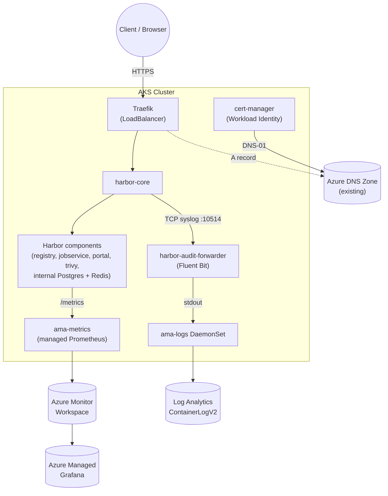

# Harbor on AKS — Terraform + Traefik + cert-manager + Azure DNS

A basic Harbor container registry install on AKS via Helm, with Terraform provisioning
exactly the Azure infrastructure needed for two companion blog posts:

- [Harbor Audit Logs in Azure Log Analytics: A Fluent Bit Bridge](https://kasunrajapakse.me/blog/harbor-audit-logs-azure-log-analytics/)
- [Monitoring Harbor with Azure Monitor and Azure Managed Grafana](https://kasunrajapakse.me/blog/monitor-harbor-azure-monitor-managed-grafana/)

Harbor is exposed over HTTPS through a Traefik ingress, with a Let's Encrypt
**production** certificate issued by cert-manager via **Azure DNS DNS-01**,
authenticated with **Azure Workload Identity** (no client secrets). The DNS
record for Harbor's hostname is created in an existing Azure DNS zone.

## 📋 Overview

| Concern | How it's covered |
|---|---|
| Container registry | Harbor Helm chart, "basic" install — bundled internal Postgres, Redis and Trivy (no external DB/object storage), persisted on the AKS default storage class (`managed-csi`) |
| Ingress | [Traefik](https://traefik.io/traefik) (Helm), `LoadBalancer` service |
| TLS | [cert-manager](https://cert-manager.io/) `ClusterIssuer`, Let's Encrypt production, DNS-01 challenge against Azure DNS |
| Identity for cert-manager | User-assigned managed identity + AKS OIDC federated credential (Azure Workload Identity) — `DNS Zone Contributor` on the zone only |
| DNS | Existing Azure DNS zone (not created by this demo) — an A record for Harbor's hostname is created/updated by `deploy.sh` |
| Audit logs | Fluent Bit sidecar re-emits Harbor's audit syslog stream to stdout → Container Insights (`ama-logs`) → Log Analytics `ContainerLogV2` |
| Metrics | Harbor Prometheus metrics + an Azure-native `ServiceMonitor` (`azmonitoring.coreos.com/v1`) → Azure Monitor managed Prometheus → Azure Managed Grafana |

## 🏗️ Architecture



## 📁 Contents

```
AKS-Harbor-Registry-Demo/
├── terraform/                       # Azure infra only (no Helm/K8s resources)
│   ├── versions.tf
│   ├── variables.tf
│   ├── main.tf
│   ├── outputs.tf
│   └── terraform.tfvars.example
├── kubernetes-manifests/
│   ├── namespace.yaml                        # harbor namespace
│   ├── audit-log-forwarder.yaml              # Fluent Bit ConfigMap+Deployment+Service
│   ├── cluster-issuer.yaml.tpl                # cert-manager ClusterIssuer (envsubst template)
│   ├── harbor-azure-monitor-servicemonitor.yaml
│   └── harbor-values.yaml.tpl                 # Harbor Helm values (envsubst template)
├── deploy.sh
├── cleanup.sh
└── README.md
```

## ✅ Prerequisites

- An **existing** Azure DNS zone already delegated to Azure DNS (this demo does not create or delegate a zone — only adds an A record to one you already own)
- Azure CLI (`az`) logged in (`az login`) with Contributor + User Access Administrator (or equivalent) on the target subscription
- Terraform >= 1.6.0
- `kubectl`, `helm` (>= 3.8), `envsubst` (part of `gettext`)

## 🚀 Quick Start

```bash
cd terraform
cp terraform.tfvars.example terraform.tfvars
# edit terraform.tfvars: dns_zone_name, dns_zone_resource_group, acme_email
cd ..
./deploy.sh
```

`deploy.sh` runs, in order:
1. `terraform apply` — resource group, AKS (workload identity + OIDC issuer enabled, Container Insights, managed Prometheus), Log Analytics, Azure Monitor workspace, Azure Managed Grafana, the cert-manager managed identity + federated credential + DNS role assignments.
2. Installs Traefik and waits for its `LoadBalancer` external IP.
3. Installs cert-manager (with CRDs, wired to the workload identity) and applies the `letsencrypt-prod` `ClusterIssuer` (Azure DNS DNS-01).
4. Applies the `harbor` namespace and the audit-log forwarder, and waits for it to be `Ready` — **Harbor's `core` container fails to start if the forwarder isn't reachable**, so ordering matters.
5. Installs Harbor via Helm with ingress/TLS wired to Traefik + cert-manager, metrics enabled, and audit forwarding configured.
6. Applies the Azure-native `ServiceMonitor` for Harbor's metrics.
7. Creates/updates the Azure DNS A record for Harbor's hostname pointing at the Traefik LoadBalancer IP.

### Terraform only

```bash
cd terraform
terraform init
terraform apply -var dns_zone_name=example.com -var dns_zone_resource_group=rg-dns-zones -var acme_email=you@example.com
```

## 🔎 Verification

**Harbor login:**
```bash
open "https://$(terraform -chdir=terraform output -raw harbor_fqdn)"
# admin / $(terraform -chdir=terraform output -raw harbor_admin_password)
```

**Audit logs in Log Analytics** (after logging in to Harbor at least once):
```kusto
ContainerLogV2
| where PodNamespace == "harbor" and ContainerName == "fluent-bit"
| extend Audit = parse_json(LogMessage)
| where isnotempty(Audit.log)
| project TimeGenerated, AuditEvent = tostring(Audit.log)
| order by TimeGenerated desc
```

**Metrics in Grafana:** open the Grafana endpoint from `terraform output -raw grafana_endpoint`, add an "Azure Monitor Managed Service for Prometheus" data source pointed at the Azure Monitor workspace, and run `harbor_up` in Explore.

## 🧹 Cleanup

```bash
./cleanup.sh
```

This removes only the Azure DNS record this demo created (never the shared zone), uninstalls the Helm releases, and runs `terraform destroy`.

## 🛠️ Troubleshooting

| Symptom | Cause | Fix |
|---|---|---|
| `harbor-core` CrashLoopBackOff on first install | Audit-log forwarder not `Ready` yet | Check `kubectl rollout status deployment/harbor-audit-forwarder -n harbor`; `helm upgrade` Harbor again once it's ready |
| Certificate stuck in `Pending` | DNS-01 propagation delay, or workload identity misconfigured | `kubectl describe certificate harbor-tls -n harbor` and `kubectl logs -n cert-manager deploy/cert-manager`; confirm the federated credential subject matches `system:serviceaccount:cert-manager:cert-manager` |
| cert-manager gets 403 from Azure DNS | RBAC propagation delay (30–90s) or missing `Reader` on the DNS zone resource group | Re-check after a minute; confirm both role assignments in `terraform/main.tf` exist |
| No audit events in `ContainerLogV2` | Container Insights excludes the `harbor` namespace, or `stdout` collection disabled | Check the cluster's Container Insights `exclude_namespaces` and `containerlog_schema_version` settings |
| `harbor_up` missing in Grafana | ServiceMonitor not discovered | `kubectl describe servicemonitor.azmonitoring.coreos.com harbor-azure-monitor -n harbor`; confirm the `http-metrics` port name and `release`/`app` labels match the Harbor Services |

## 🔒 Security notes

- The Harbor admin password is generated by Terraform (`random_password`), marked `sensitive`, and never written to a committed file — retrieve it with `terraform output -raw harbor_admin_password`.
- cert-manager uses Azure Workload Identity (federated credential), not a client secret, and is scoped to `DNS Zone Contributor` on the single DNS zone plus `Reader` on its resource group — not subscription-wide access.
- `terraform.tfvars` is gitignored; only `terraform.tfvars.example` (placeholder values) is committed.

## 🔮 Future Enhancement: Azure AD (Microsoft Entra ID) OIDC SSO

This demo reserves — but does not enable — Azure AD OIDC login for Harbor, for a follow-up demo:

- `terraform output -raw harbor_oidc_redirect_uri` already gives the exact redirect URI (`https://<harbor_fqdn>/c/oidc/callback`) needed to register an Entra ID app registration.
- `variables.tf` already has disabled placeholders: `enable_oidc_auth`, `oidc_client_id`, `oidc_client_secret`.
- To enable it later: register an Entra ID app with that redirect URI, then add `auth_mode`, `oidc_name`, `oidc_endpoint`, `oidc_client_id`, `oidc_client_secret`, `oidc_scope`, `oidc_verify_cert`, `oidc_auto_onboard`, `oidc_user_claim` to the `core.configureUserSettings` JSON block in `kubernetes-manifests/harbor-values.yaml.tpl` (a commented template is already there) and re-run `helm upgrade`.
- **Caveat:** once `configureUserSettings` (`CONFIG_OVERWRITE_JSON`) is set, *all* Harbor user-scope settings — including `auth_mode` — become read-only in the Harbor UI. Changing auth after this point means editing values and redeploying, not using Administration → Configuration.
- Harbor's local `admin` account always stays DB-authenticated, so it remains a break-glass login even after OIDC is enabled.

## 📚 Further Reading

- [Harbor Audit Logs in Azure Log Analytics: A Fluent Bit Bridge](https://kasunrajapakse.me/blog/harbor-audit-logs-azure-log-analytics/)
- [Monitoring Harbor with Azure Monitor and Azure Managed Grafana](https://kasunrajapakse.me/blog/monitor-harbor-azure-monitor-managed-grafana/)
- [Harbor Helm chart](https://github.com/goharbor/harbor-helm)
- [cert-manager Azure DNS solver](https://cert-manager.io/docs/configuration/acme/dns01/azuredns/)
- [Traefik Helm chart](https://github.com/traefik/traefik-helm-chart)
