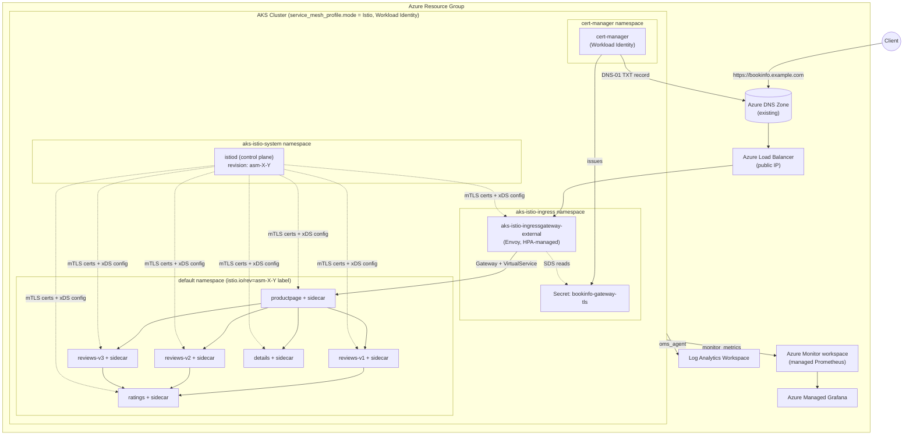

# AKS Istio Service Mesh Add-on Deep Dive

A hands-on deep dive into the **Istio-based service mesh add-on for Azure Kubernetes Service (AKS)**: what it actually installs, mutual TLS, traffic management (canary/weighted routing, header-based routing, fault injection), zero-trust authorization policies, ingress, observability, and — critically — where the managed add-on's guardrails stop and when you should reach for a self-managed, open-source Istio install instead.

> **Not to be confused with:** the [`AKS-Istio-Gateway-API`](../AKS-Istio-Gateway-API/README.md) demo in this repo, which covers the **App Routing (Istio) add-on** — a lightweight, ingress-only Envoy gateway with no sidecars, no mesh, and no CRDs. This demo covers the full **Istio service mesh add-on**: sidecar injection, `istiod`, mTLS everywhere, and the complete Istio CRD surface. See [When to choose which](#when-to-choose-which) for a side-by-side comparison of all three options (App Routing Istio, the mesh add-on, and self-managed OSS Istio).

> **References:**
> [Istio-based service mesh add-on for AKS](https://learn.microsoft.com/azure/aks/istio-about) ·
> [Deploy the add-on](https://learn.microsoft.com/azure/aks/istio-deploy-addon) ·
> [Upgrade the add-on](https://learn.microsoft.com/azure/aks/istio-upgrade) ·
> [Performance & scaling](https://learn.microsoft.com/azure/aks/istio-scale) ·
> [`azurerm_kubernetes_cluster` `service_mesh_profile`](https://registry.terraform.io/providers/hashicorp/azurerm/latest/docs/resources/kubernetes_cluster) ·
> [cert-manager Azure DNS solver](https://cert-manager.io/docs/configuration/acme/dns01/azuredns/)

---

## What this demo builds


```mermaid
graph TB
    subgraph Azure["Azure Resource Group"]
        subgraph AKS["AKS Cluster (service_mesh_profile.mode = Istio, Workload Identity)"]
            subgraph MeshSys["aks-istio-system namespace"]
                Istiod["istiod (control plane)<br/>revision: asm-X-Y"]
            end
            subgraph MeshIngress["aks-istio-ingress namespace"]
                GW["aks-istio-ingressgateway-external<br/>(Envoy, HPA-managed)"]
                TLSSecret["Secret: bookinfo-gateway-tls"]
            end
            subgraph CertMgrNs["cert-manager namespace"]
                CertMgr["cert-manager<br/>(Workload Identity)"]
            end
            subgraph Default["default namespace (istio.io/rev=asm-X-Y label)"]
                PP["productpage + sidecar"]
                RV1["reviews-v1 + sidecar"]
                RV2["reviews-v2 + sidecar"]
                RV3["reviews-v3 + sidecar"]
                RT["ratings + sidecar"]
                DT["details + sidecar"]
            end
        end
        LB["Azure Load Balancer<br/>(public IP)"]
        LAW["Log Analytics Workspace"]
        PROM["Azure Monitor workspace<br/>(managed Prometheus)"]
        GRAF["Azure Managed Grafana"]
        DNS[("Azure DNS Zone<br/>(existing)")]
    end

    Internet(("Client")) -->|"https://bookinfo.example.com"| DNS --> LB --> GW
    GW -->|"Gateway + VirtualService"| PP
    PP --> RV1 & RV2 & RV3
    RV1 & RV2 & RV3 --> RT
    PP --> DT
    Istiod -.->|"mTLS certs + xDS config"| PP & RV1 & RV2 & RV3 & RT & DT & GW
    CertMgr -->|"DNS-01 TXT record"| DNS
    CertMgr -->|"issues"| TLSSecret
    GW -.->|"SDS reads"| TLSSecret
    AKS -->|oms_agent| LAW
    AKS -->|monitor_metrics| PROM --> GRAF
```

| Layer | What's provisioned | How |
|---|---|---|
| Resource group + AKS cluster | Azure CNI Overlay, standard LB, system node pool, OIDC issuer + Workload Identity enabled | Terraform (`terraform/main.tf`) |
| **Istio add-on** | `istiod` control plane + external ingress gateway, via `service_mesh_profile { mode = "Istio" }` | Terraform |
| Observability (officially verified path) | Log Analytics, Azure Monitor managed Prometheus, Azure Managed Grafana | Terraform |
| **TLS for the ingress gateway** | cert-manager (Workload Identity, no client secret) + a `ClusterIssuer` using the Azure DNS DNS-01 solver against your **existing** Azure DNS zone | Terraform (identity/RBAC) + `deploy.sh` (Helm install + `kubectl apply`) |
| Sample mesh app | Istio's `bookinfo` app (productpage/details/reviews v1-v3/ratings) | `deploy.sh` (`kubectl apply` from the istio/istio release matching the installed revision) |
| Traffic management | `DestinationRule` subsets, weighted/canary `VirtualService`, header-based routing, fault injection | `kubernetes-manifests/traffic-management/` |
| Security | Mesh-wide strict mTLS (`PeerAuthentication`), identity-based `AuthorizationPolicy` | `kubernetes-manifests/security/` |
| Ingress | Istio `Gateway` (HTTP→HTTPS redirect + TLS termination) + `VirtualService`, bound to the AKS-managed external ingress gateway, on your real Azure DNS hostname | `kubernetes-manifests/ingress/*.tpl` (rendered by `deploy.sh`) |

---

## Prerequisites

| Requirement | Notes |
|---|---|
| **Azure subscription** with quota for the chosen node VM size (`Standard_D4ds_v5` x 3 by default) | |
| **Azure CLI >= 2.57.0** | Required by the add-on's `az aks mesh` command group. Run `az --version`. |
| **`aks-preview` CLI extension** | Only needed for optional day-2 diagnostics (`az aks mesh get-revisions`, `az aks mesh get-upgrades`). `deploy.sh` installs/updates it best-effort; not required for the Terraform-driven deploy in this demo. |
| **Terraform >= 1.6** | Provisions the AKS cluster with the add-on enabled. |
| **kubectl** | Any recent version compatible with your target Kubernetes version. |
| **jq** | Used by `deploy.sh` (to parse Terraform outputs) and by Terraform itself, via `terraform/scripts/default-istio-revision.sh`, to auto-detect a supported Istio revision when `istio_revisions` is left empty. |
| **`istioctl` (optional)** | Only needed for advanced day-2 operations such as revision-tag based canary upgrades ([Upgrade the add-on](https://learn.microsoft.com/azure/aks/istio-upgrade)) — not required for this demo. |
| **AKS cluster version >= 1.23** | Enforced by Terraform/AKS itself; `terraform.tfvars.example` defaults to a recent GA minor version. |
| No **Open Service Mesh (OSM) add-on** and no **self-managed Istio install** already on the target cluster | The Istio add-on refuses to coexist with either — see [Limitations](#limitations-of-the-aks-istio-add-on). |
| **Helm 3** | Installs cert-manager (not part of the Istio add-on itself). |
| **`envsubst`** (part of `gettext`) | Renders the `.tpl` manifests (`kubernetes-manifests/**/*.tpl`) with Terraform outputs before `kubectl apply`. On macOS: `brew install gettext`. |
| **An existing Azure DNS zone** already delegated to Azure DNS (e.g. `example.com`), plus its resource group | `deploy.sh` does **not** create the zone — only an A record for the sample app inside it, and a TXT record per DNS-01 challenge. Pass it via `dns_zone_name`/`dns_zone_resource_group` in `terraform.tfvars`. |
| **A contact email** for Let's Encrypt (`acme_email` in `terraform.tfvars`) | Used for certificate expiry notices, not for login. |

---

## Deploying

```bash
cd AKS-Istio-Service-Mesh-Demo
cp terraform/terraform.tfvars.example terraform/terraform.tfvars
# edit terraform.tfvars: set dns_zone_name, dns_zone_resource_group, bookinfo_subdomain, acme_email
az login
./deploy.sh
```

`deploy.sh` runs `terraform apply` (creating the resource group, AKS cluster with the Istio add-on, the cert-manager Workload Identity/RBAC, and the observability stack), fetches credentials, installs cert-manager and a Let's Encrypt `ClusterIssuer` (Azure DNS DNS-01), waits for `istiod`, labels the `default` namespace for sidecar injection, deploys the `bookinfo` sample app, applies the baseline traffic-management/security manifests, then renders and applies the ingress `Gateway`/`VirtualService` for your real hostname, points your Azure DNS zone's A record at the gateway's public IP, and waits for the certificate to become `Ready`. It prints the HTTPS URL and the Azure Managed Grafana endpoint at the end.

`dns_zone_name`, `dns_zone_resource_group`, and `acme_email` have no defaults and must be set in `terraform.tfvars` before the first apply. To further customize the deployment (region, node size, ingress gateway placement, a pinned Istio revision, etc.), edit the rest of `terraform/terraform.tfvars.example` as needed.

---

## Demo walkthrough

Every manifest in `kubernetes-manifests/` demonstrates one specific Istio concept. Quick reference before diving in:

| # | Concept | Manifest(s) | What it proves |
|---|---|---|---|
| 1 | Sidecar injection | *(automatic — namespace label)* | Every pod gets an Envoy proxy transparently, no app code changes |
| 2 | Mutual TLS (`STRICT`) | `security/peer-authentication-strict.yaml` | Zero-trust transport: plaintext traffic between mesh workloads is rejected |
| 3a | Deterministic routing | `traffic-management/destination-rule-reviews.yaml` + `virtualservice-all-v1.yaml` | `VirtualService`/`DestinationRule` override Kubernetes' default round-robin across all pod versions |
| 3b | Weighted canary rollout | `virtualservice-canary-v3.yaml` | Progressive delivery — shift a % of traffic to a new version without redeploying |
| 3c | Header-based routing | `virtualservice-user-routing.yaml` | Route specific users/cohorts to a specific version (dogfooding, beta rings) |
| 3d | Fault injection | `virtualservice-fault-injection.yaml` | Chaos-test downstream latency/timeout handling without touching app code |
| 4 | Identity-based authorization | `security/authorization-policy-ratings.yaml` | Zero-trust access control keyed on cryptographic workload identity (SPIFFE), not IP/network |
| 5 | Ingress + TLS | `ingress/gateway.yaml.tpl` + `ingress/virtualservice-productpage.yaml.tpl` + cert-manager | Edge encryption terminated by the AKS-managed gateway, certificate lifecycle fully automated |
| 6 | Observability | Azure Monitor managed Prometheus + Grafana (Terraform) | Golden-signal metrics (`istio_requests_total`, latency histograms) with zero app instrumentation |

### 1. Sidecar injection — the data plane

**What it demonstrates:** Istio's core mechanism — every pod in a labeled namespace gets a second container (`istio-proxy`, an Envoy proxy) injected automatically at admission time. All the concepts below work *because* this proxy transparently intercepts every request in and out of the pod.

```bash
kubectl get pods -n aks-istio-system                  # istiod
kubectl get pods -n aks-istio-ingress                  # external ingress gateway
kubectl get pods -n default -o jsonpath='{range .items[*]}{.metadata.name}{"\t"}{.spec.containers[*].name}{"\n"}{end}'
```

**Expected result:** every `bookinfo` pod lists two containers (the app + `istio-proxy`). On Kubernetes 1.29+ revisions `istio-proxy` may instead run as a *native sidecar* `initContainer` — `kubectl describe pod <pod>` will show it either way, and `kubectl get pods` still reports `2/2 Running`.

### 2. Mutual TLS — zero-trust transport security

**What it demonstrates:** `deploy.sh` already applied `security/peer-authentication-strict.yaml`, putting the entire mesh in `STRICT` mTLS mode — every sidecar-to-sidecar connection must be mutually authenticated with certificates `istiod` issues and rotates automatically. There is no app-level TLS code anywhere in `bookinfo`.

**Test it — prove plaintext traffic is rejected:** run a pod *without* a sidecar (skip injection with an annotation) in the same namespace, and try to call a mesh service directly:

```bash
kubectl run plaintext-test --image=curlimages/curl --restart=Never --rm -it \
  --annotations="sidecar.istio.io/inject=false" -n default -- \
  curl -sS --max-time 5 http://productpage:9080/productpage
```

**Expected result:** the connection is reset (`curl: (56) Recv failure: Connection reset by peer` or similar) — `productpage`'s own sidecar refuses the plaintext handshake. Delete the `PeerAuthentication` (`kubectl delete peerauthentication default -n aks-istio-system`) and re-run the same command to see it succeed instead — then re-apply it to restore `STRICT` mode.

### 3. Traffic management

All four manifests act on the same `reviews` service; apply them **in order** to build up the story (each overwrites the previous `VirtualService`/`DestinationRule` object since they share the same `metadata.name`).

**3a. Deterministic routing (baseline).** By default, Kubernetes' `reviews` Service round-robins across *all* `v1`/`v2`/`v3` pods with no control over the mix. `destination-rule-reviews.yaml` defines named subsets by the `version` pod label; `virtualservice-all-v1.yaml` pins 100% of traffic to `v1` (no star ratings) — already applied by `deploy.sh`.

```bash
kubectl get destinationrule reviews -n default -o yaml
kubectl get virtualservice reviews -n default -o yaml
```

**3b. Weighted canary rollout.** Shifts traffic between `v1` (stable) and `v3` (red stars) by percentage — the textbook canary-release pattern, with zero redeploys.

```bash
kubectl apply -f kubernetes-manifests/traffic-management/virtualservice-canary-v3.yaml
```

**Test it — prove the 90/10 split empirically** (re-run after logging into `https://<bookinfo_fqdn>/productpage` as any user, or via curl):

```bash
for i in $(seq 1 20); do
  curl -s "https://$(terraform -chdir=terraform output -raw bookinfo_fqdn)/productpage" | grep -o 'color="[a-z]*"'
done | sort | uniq -c
```

**Expected result:** roughly 18x no-color/blank (v1) vs. 2x `color="red"` (v3) over 20 requests. Re-apply with adjusted weights (e.g. 50/50) and re-run to watch the ratio shift live.

**3c. Header-based routing.** Routes a *specific* end-user to a specific version — useful for internal dogfooding or targeted beta cohorts, independent of weighted rollout.

```bash
kubectl apply -f kubernetes-manifests/traffic-management/virtualservice-user-routing.yaml
```

**Test it:** log into the web UI as user `jason` (any password) — you should always see `v2` (black stars); log in as anyone else (or stay logged out) and you always see `v1`. To test without a browser:

```bash
FQDN=$(terraform -chdir=terraform output -raw bookinfo_fqdn)
COOKIE_JAR=$(mktemp)
curl -s -c "$COOKIE_JAR" -d "username=jason&password=x" "https://${FQDN}/login" >/dev/null
curl -s -b "$COOKIE_JAR" "https://${FQDN}/productpage" | grep -o 'color="[a-z]*"'
# -> color="black" every time, regardless of how many times you repeat it
```

**3d. Fault injection.** Injects a fixed 7s delay into calls to `ratings` — a chaos-engineering technique for validating that callers (timeouts, retries, circuit breakers, user-facing loading states) behave correctly under degraded dependencies, without touching any application code.

> **Prerequisite:** `reviews-v1` never calls `ratings` at all (that's why it shows no stars), so the delay is invisible unless `jason` is routed to `v2`/`v3` first — apply **3c or 3b** before this step.

```bash
kubectl apply -f kubernetes-manifests/traffic-management/virtualservice-fault-injection.yaml
```

**Test it:**

```bash
time curl -s -b "$COOKIE_JAR" "https://${FQDN}/productpage" >/dev/null
# -> real  0m7.0xxs   (every other user is unaffected and returns immediately)
```

### 4. Authorization Policy — zero-trust identity-based access control

**What it demonstrates:** with `STRICT` mTLS in place, Istio can enforce access control based on a workload's cryptographically-verified **identity** (its Kubernetes ServiceAccount, expressed as a SPIFFE principal) rather than IP address or network segment — the essence of zero-trust. `authorization-policy-ratings.yaml` allows only the `bookinfo-reviews` ServiceAccount to call `ratings`; everything else is denied by default once any `AuthorizationPolicy` selects a workload.

```bash
kubectl apply -f kubernetes-manifests/security/authorization-policy-ratings.yaml

# Prove it: a pod with no matching ServiceAccount identity gets rejected
kubectl run curl --image=curlimages/curl -n default --rm -it --restart=Never -- \
  curl -sS -o /dev/null -w "%{http_code}\n" http://ratings:9080/ratings/0
# -> 403 RBAC: access denied

# But the app still works end-to-end, because reviews (the allowed identity) still calls ratings on its behalf:
curl -s "https://${FQDN}/productpage" -o /dev/null -w "%{http_code}\n"
# -> 200
```

### 5. Ingress — HTTPS via cert-manager + your Azure DNS zone

**What it demonstrates:** edge encryption for the mesh's public entry point, with the entire certificate lifecycle (issuance, DNS-01 validation, renewal) automated — no manually-uploaded certs, no client secrets.

```bash
curl -sv "https://$(terraform -chdir=terraform output -raw bookinfo_fqdn)/productpage" | head -n 5
```

What makes this work end to end:

1. **Terraform** creates a user-assigned managed identity for cert-manager, a federated credential trusting the AKS cluster's OIDC issuer (Azure Workload Identity — no client secret), and grants it `DNS Zone Contributor` scoped to *only* your existing DNS zone (not the whole subscription/resource group).
2. **`deploy.sh`** installs cert-manager via Helm with that identity's client ID annotated on its service account, applies a `letsencrypt-prod` `ClusterIssuer` configured with the [Azure DNS DNS-01 solver](https://cert-manager.io/docs/configuration/acme/dns01/azuredns/), and requests a `Certificate` for your hostname.
3. cert-manager proves domain ownership by writing a `TXT` record into your Azure DNS zone, then writes the issued certificate into a `Secret` named `bookinfo-gateway-tls` **in the `aks-istio-ingress` namespace** — that's a hard requirement: the AKS-managed ingress gateway pods only read TLS secrets (via SDS) from their own pod namespace, regardless of which namespace the `Gateway` resource itself lives in.
4. The rendered `Gateway` (`kubernetes-manifests/ingress/gateway.yaml.tpl`) terminates TLS on port 443 using `credentialName: bookinfo-gateway-tls` and redirects port 80 to HTTPS.
5. `deploy.sh` also creates/updates an **A record** for your subdomain in the same Azure DNS zone, pointing at the ingress gateway's public IP.

Check certificate status directly if needed:

```bash
kubectl get certificate bookinfo-gateway-tls -n aks-istio-ingress
kubectl describe certificate bookinfo-gateway-tls -n aks-istio-ingress
```

### 6. Observability

**What it demonstrates:** Istio's sidecars emit golden-signal metrics (request volume, error rate, latency) for every service **automatically** — no app instrumentation. This demo wires up the path Microsoft explicitly verifies for the add-on — **Azure Monitor managed Prometheus + Azure Managed Grafana** (see [How is the add-on different from open-source Istio?](https://learn.microsoft.com/azure/aks/istio-about#how-is-the-add-on-different-from-open-source-istio)):

```bash
terraform -chdir=terraform output grafana_endpoint
```

Import Istio's official dashboards (control plane, mesh, service, workload — [istio.io/latest/docs/ops/integrations/grafana](https://istio.io/latest/docs/ops/integrations/grafana/)) into the Grafana workspace and query `istio_requests_total`, `istio_request_duration_milliseconds_bucket`, etc. — generate the traffic from sections 3-4 above first so there's something to see.

**Kiali and Jaeger/distributed tracing are *not* part of the managed add-on** — they're optional, self-managed OSS components you install yourself with Helm, pointed at the add-on's control plane namespace (`aks-istio-system` instead of the upstream default of `istio-system`). Treat this as an advanced follow-up exercise; see [Kiali's Helm install docs](https://kiali.io/docs/installation/installation-guide/) and the [Istio addons](https://github.com/istio/istio/tree/master/samples/addons) sample manifests as starting points.

---

## Limitations of the AKS Istio add-on

Straight from [Microsoft's documented limitations](https://learn.microsoft.com/azure/aks/istio-about#limitations) — know these before you commit to the add-on for a production mesh:

- **No coexistence** with the Open Service Mesh (OSM) add-on or a self-managed/manual Istio install on the same cluster.
- **No virtual nodes** (ACI-backed pods) in the mesh.
- **No Ambient mode** (sidecar-less data plane) yet — Microsoft is contributing upstream, but there's no add-on integration timeline.
- **No multi-cluster mesh** — single-cluster only.
- **No Windows Server containers** in the mesh (upstream Istio itself doesn't support this yet either).
- **Blocked custom resources**: `ProxyConfig`, `WorkloadEntry`, `WorkloadGroup`, `IstioOperator`, `WasmPlugin` cannot be used to customize the add-on.
- **`EnvoyFilter` is allowed but unsupported** — issues caused by a custom `EnvoyFilter` (e.g. a broken Lua script) are outside Microsoft's support scope.
- **No Gateway API / GAMMA support** for mesh traffic management via this add-on (that's the separate App Routing Istio Gateway API feature, ingress-only).
- Only a **subset of `MeshConfig`** fields can be customized; others are unsupported or entirely blocked.
- **No automatic upgrades** — an out-of-date Istio revision is *not* upgraded when the AKS cluster auto-upgrades, and can eventually block the cluster's own auto-upgrade. You must run `az aks mesh upgrade` yourself.
- Only **one internal and one external ingress gateway** are allowed per cluster.
- Ingress/egress gateway **port/protocol customization is not supported** (only annotations and `externalTrafficPolicy`).
- Istio versions are pinned to Microsoft-tested **revisions** (`asm-X-Y`) on a support calendar — you don't get upstream Istio releases the day they ship.

---

## When to choose which

| | **App Routing (Istio) add-on**<br/>[`AKS-Istio-Gateway-API`](../AKS-Istio-Gateway-API/README.md) | **Istio service mesh add-on**<br/>(this demo) | **Self-managed OSS Istio** |
|---|---|---|---|
| Scope | Ingress only | Full mesh: north-south + east-west | Full mesh, fully customizable |
| Sidecars | None | Injected cluster-wide | Injected cluster-wide (or Ambient) |
| Support | Microsoft | Microsoft (within documented limits) | Self-supported / community |
| Upgrade ownership | Microsoft-managed | You trigger it; Microsoft ships tested revisions | Entirely yours, any cadence |
| Customization ceiling | Low | Medium (blocked CRDs, subset of `MeshConfig`) | Full Istio API surface |
| Multi-cluster / Ambient / Gateway API for mesh traffic | N/A | ❌ Not supported | ✅ Supported |
| Operational effort | Minimal | Low-medium | High (you own istiod scaling, CA rotation, CVE patching, CRD lifecycle) |

**Choose the AKS Istio service mesh add-on (this demo) when:**
- You need real mesh features — mTLS everywhere, fine-grained `AuthorizationPolicy`, canary/weighted routing, retries/circuit breaking — on a **single AKS cluster**.
- You want Microsoft to own `istiod` scaling, verified compatibility with your AKS version, and official support, and you can live with the add-on's blocked customizations.
- Your observability needs are satisfied by **Azure Monitor managed Prometheus + Azure Managed Grafana** (the officially verified path), and Kiali/Jaeger (if wanted) can be self-installed as a side project.
- You're fine following Microsoft's Istio revision support calendar rather than tracking every upstream Istio release the day it lands.

**Choose self-managed OSS Istio when:**
- You need **Ambient mode**, **multi-cluster/multi-network mesh**, or Istio's **Gateway API (GAMMA)** support for mesh traffic — none of which the add-on offers today.
- You need to customize `ProxyConfig`, `WorkloadEntry`, `WorkloadGroup`, `IstioOperator`, or `WasmPlugin`, or need full `MeshConfig` control.
- You need the latest upstream Istio minor/patch release immediately, not gated by AKS's revision support calendar.
- You're running a consistent mesh across non-AKS or multi-cloud/hybrid clusters and want one Istio version/toolchain everywhere.
- You're prepared to own istiod scaling, CA/certificate rotation, CVE patching, and CRD lifecycle yourself (or via a vendor other than Microsoft, e.g. Istio-in-a-box distros).

**Choose the App Routing (Istio) add-on instead of both when:** all you need is modern L7 ingress (Gateway API, TLS termination, header/path routing) with **no mesh, no sidecars, and minimal operational surface** — see the [AKS-Istio-Gateway-API](../AKS-Istio-Gateway-API/README.md) demo.

---

## Upgrading the add-on (day 2)

The add-on uses [canary minor-revision upgrades](https://learn.microsoft.com/azure/aks/istio-upgrade): the new revision's control plane runs alongside the existing one, you manually roll data-plane workloads over (relabel namespace + restart pods), verify health, then complete or roll back. In Terraform terms this maps to setting `istio_revisions = ["asm-X-Y", "asm-X-Z"]` (both revisions) during the canary window, then back down to a single-element list once you commit. Patch versions (proxy/istiod image patches within the same revision) roll out automatically via AKS releases; you still restart workloads yourself to pick up the patched sidecar image.

## Cleanup

```bash
./cleanup.sh
```

Prompts for confirmation, then removes the A record `deploy.sh` added to your Azure DNS zone (the zone itself is never touched), runs `terraform destroy`, removes local state files, deletes the `.terraform` provider cache and rendered manifest cache, and removes the cluster's context/cluster/user entries from your local `~/.kube/config` — leaving no orphaned Azure resources, stale provider locks, or dead kubeconfig entries behind.

## Troubleshooting

| Symptom | Likely cause |
|---|---|
| Pods stuck with 1/1 containers instead of 2/2 | Namespace isn't labeled with `istio.io/rev=<revision>` (the generic `istio-injection=enabled` label does **not** work for the add-on), or the pod was created before the label was applied — restart the deployment. |
| `403 RBAC: access denied` on requests that should be allowed | Check the `AuthorizationPolicy` `selector` and `principals` match the caller's actual ServiceAccount (`kubectl get pod <pod> -o jsonpath='{.spec.serviceAccountName}'`). |
| `terraform apply`/`plan` fails with `No Istio add-on revision compatible with Kubernetes ...` | No supported Istio revision for your `location`/`kubernetes_version` combo. Run `az aks mesh get-revisions --location <region> -o table` (requires `aks-preview`) and either adjust `kubernetes_version` or pin a supported `istio_revisions` value in `terraform.tfvars`. |
| Ingress gateway has no external IP | Standard Load Balancer provisioning can take a few minutes; re-run `kubectl get svc aks-istio-ingressgateway-external -n aks-istio-ingress -w`. |
| `Certificate` stuck `Pending`/not `Ready` | DNS-01 propagation delay (wait a minute and re-check), or Workload Identity misconfigured. Check `kubectl describe certificate bookinfo-gateway-tls -n aks-istio-ingress` and `kubectl logs -n cert-manager deploy/cert-manager`; confirm the federated credential subject matches `system:serviceaccount:cert-manager:cert-manager`. |
| cert-manager gets a `403`/`Forbidden` from Azure DNS | RBAC propagation delay (wait 30-90s after `terraform apply`) or the `DNS Zone Contributor` role assignment on `data.azurerm_dns_zone.this` is missing/wrong — check `terraform/main.tf`. |
| `productpage` loads over HTTP but not HTTPS, or shows a self-signed cert warning | The `Secret` `bookinfo-gateway-tls` doesn't exist yet in `aks-istio-ingress` — the `Certificate` hasn't finished issuing. Confirm with `kubectl get secret bookinfo-gateway-tls -n aks-istio-ingress`. |
| `bookinfo_fqdn` doesn't resolve | The A record `deploy.sh` created can take a few minutes to propagate; verify it exists with `az network dns record-set a show --resource-group <dns_zone_resource_group> --zone-name <dns_zone_name> --name <bookinfo_subdomain>`. |
