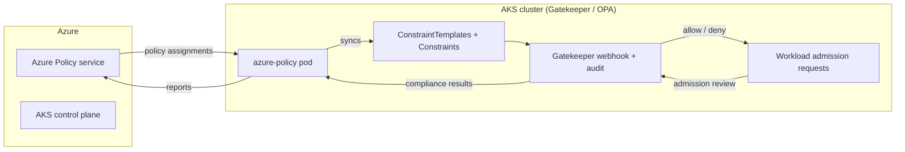

# AKS + Azure Policy for Kubernetes (OPA / Gatekeeper) Demo

This demo provisions an AKS cluster with the **Azure Policy Add-on** enabled and
assigns a curated set of Kubernetes security policies to it. Under the hood, the
Azure Policy Add-on installs [Gatekeeper](https://open-policy-agent.github.io/gatekeeper/website/) v3
(an [Open Policy Agent](https://www.openpolicyagent.org/) admission controller) on
the cluster and translates each Azure Policy assignment into Gatekeeper
`ConstraintTemplate` and `Constraint` custom resources. Compliance results are
reported back to Azure Policy for a unified view alongside your other Azure
resources.



## What gets deployed

1. **Terraform** (`terraform/`) — a resource group, VNet/subnet, Log Analytics
   workspace, and an AKS cluster with `azure_policy_enabled = true` (Azure CNI
   Overlay + Azure network policy, Container Insights wired to Log Analytics).
2. **Built-in Kubernetes policies** (`policies/builtin/`) — seven of Microsoft's
   official, maintained Azure Policy definitions for Kubernetes, each backed by
   an Azure-authored Gatekeeper constraint template:
   - Deny privileged containers (CIS 5.2.1)
   - Deny sharing of host PID/IPC/network namespaces (CIS 5.2.2/5.2.3)
   - Deny container privilege escalation (CIS 5.2.5)
   - Require a read-only root filesystem
   - Require CPU/memory resource limits
   - Deny use of the `default` namespace
   - Allow only container images matching an approved registry pattern
3. **One custom OPA/Rego policy** (`policies/custom/`) — a hand-authored Azure
   Policy definition that wraps the open-source
   [Gatekeeper library's `K8sRequiredLabels`](https://github.com/open-policy-agent/gatekeeper-library/blob/master/library/general/requiredlabels/template.yaml)
   constraint template to require `team`/`environment` labels on every Pod —
   showing the full workflow for writing and assigning your **own** OPA policy
   through Azure Policy (not just built-ins).
4. **Sample manifests** (`sample-apps/`) — one fully compliant pod and one
   pod per policy that deliberately violates it, for testing.

## Prerequisites

- Azure CLI (`az`), logged in (`az login`) with **Resource Policy Contributor**
  or **Owner** on the target subscription
- Terraform >= 1.6
- `kubectl`, `jq`
- An AKS-supported region and quota for a 3-node `Standard_D2s_v5` node pool

## Deploy

```bash
./deploy.sh
```

By default all policies are assigned with `effect=audit` — non-compliant
resources are still created but reported as non-compliant (safe to demo
without breaking anything). To see live admission-time blocking instead:

```bash
EFFECT=deny ./deploy.sh
```

> The Azure Policy add-on checks in with the Azure Policy service roughly every
> **15 minutes**. Allow up to 15 minutes after `deploy.sh` finishes before the
> Gatekeeper `ConstraintTemplates`/`Constraints` appear on the cluster.

## Test

```bash
./scripts/test-policies.sh
```

This applies `sample-apps/good-pod.yaml` (should always succeed) and every
`sample-apps/bad-pod-*.yaml` file (each violates exactly one policy). With
`effect=audit` all pods are admitted; with `effect=deny` the violating pods
are rejected by the Gatekeeper admission webhook.

You can also inspect what the add-on installed directly:

```bash
kubectl get constrainttemplates | grep k8sazure
kubectl get pods -n gatekeeper-system
kubectl get pods -n kube-system -l app=azure-policy
```

And view compliance in the Azure portal under **Policy > Compliance**, scoped
to the resource group, or via:

```bash
az policy state list --resource-group <rg> --filter "PolicyDefinitionAction eq 'audit'"
```

## Customizing

- Edit the `imageRegex` parameter in
  `policies/builtin/allowed-images.parameters.json` to match your own
  container registry (for example your ACR login server).
- Edit `policies/custom/require-team-labels.parameters.json` to change which
  labels are required or their allowed values.
- Add more policies by appending entries to `policies/builtin/manifest.json`
  and a matching parameters file — `deploy.sh` will pick them up automatically.

## Cleanup

```bash
./cleanup.sh
```

Removes the policy assignments and the custom policy definition, then runs
`terraform destroy` for the AKS infrastructure.

## References

- [Azure Policy for Kubernetes](https://learn.microsoft.com/azure/governance/policy/concepts/policy-for-kubernetes)
- [Built-in Kubernetes policy definitions](https://learn.microsoft.com/azure/governance/policy/samples/built-in-policies#kubernetes)
- [Gatekeeper library (community constraint templates)](https://github.com/open-policy-agent/gatekeeper-library)
