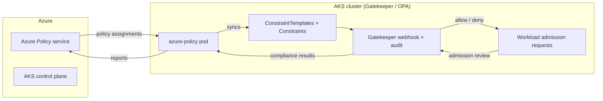

# AKS + Azure Policy for Kubernetes (OPA / Gatekeeper) Demo

This demo provisions an AKS cluster with the **Azure Policy Add-on** enabled and
assigns a curated set of Kubernetes security policies to it. Under the hood, the
Azure Policy Add-on installs [Gatekeeper](https://open-policy-agent.github.io/gatekeeper/website/) v3
(an [Open Policy Agent](https://www.openpolicyagent.org/) admission controller) on
the cluster and translates each Azure Policy assignment into Gatekeeper
`ConstraintTemplate` and `Constraint` custom resources. Compliance results are
reported back to Azure Policy for a unified view alongside your other Azure
resources.



## What gets deployed

- **Terraform** (`terraform/`) — a resource group, VNet/subnet, Log Analytics
   workspace, and an AKS cluster with `azure_policy_enabled = true` (Azure CNI
   Overlay + Azure network policy, Container Insights wired to Log Analytics).
- **Fifteen fully custom, OPA/Rego-backed Azure Policy definitions**
   (`policies/custom/`) — every policy in this demo is a complete, hand-authored
   `Microsoft.Authorization/policyDefinitions` JSON body (not a reference to one
   of Microsoft's built-in policy GUIDs, so you can see exactly how a custom
   Kubernetes policy is put together end-to-end.

### Policy reference

| Policy | What it checks | Compliant configuration | Violation sample |
| --- | --- | --- | --- |
| `deny-privileged-containers` | Blocks containers with `securityContext.privileged: true`. | `privileged: false` or omitted. | `bad-pod-privileged.yaml` |
| `deny-host-namespaces` | Blocks sharing the host PID or IPC namespace. | `hostPID: false` and `hostIPC: false` or omitted. | `bad-pod-host-namespace.yaml` |
| `deny-privilege-escalation` | Blocks containers that allow privilege escalation. | `securityContext.allowPrivilegeEscalation: false`. | `bad-pod-privilege-escalation.yaml` |
| `require-readonly-root-fs` | Requires the container root filesystem to be read-only. | `securityContext.readOnlyRootFilesystem: true`. | `bad-pod-writable-root-fs.yaml` |
| `require-resource-limits` | Requires CPU and memory limits and checks them against configured maximums. | `resources.limits.cpu` and `resources.limits.memory` are present and within bounds. | `bad-pod-no-resource-limits.yaml` |
| `allowed-repos` | Allows images only when they start with an approved repository prefix. | For example, `docker.io/library/nginx:1.27-alpine`. | `bad-pod-disallowed-image.yaml` |
| `deny-default-namespace` | Blocks Pods deployed to the Kubernetes `default` namespace. | Deploy workloads into a dedicated namespace such as `workloads`. | `bad-pod-default-namespace.yaml` |
| `require-team-labels` | Requires `team` and `environment` labels; `environment` must match `dev`, `staging`, or `prod`. | Pod has both labels with an allowed environment value. | `bad-pod-missing-labels.yaml` |
| `require-non-root` | Requires every container to run as a non-root user. | `securityContext.runAsNonRoot: true`; do not use UID `0`. | `bad-pod-root.yaml` |
| `require-seccomp-runtime-default` | Requires the effective container seccomp profile to be the Kubernetes default profile. | Pod or container `securityContext.seccompProfile.type: RuntimeDefault`; container-level settings override Pod-level settings. | `bad-pod-no-seccomp.yaml`, `bad-pod-security-context-override.yaml` |
| `drop-all-capabilities` | Requires every container to drop Linux capabilities. | `securityContext.capabilities.drop: ["ALL"]`. | `bad-pod-capabilities.yaml` |
| `deny-host-network` | Blocks Pods that share the node network namespace. | `spec.hostNetwork: false` or omitted. | `bad-pod-host-network.yaml` |
| `deny-latest-image-tags` | Blocks mutable `:latest` image tags. | Pin an explicit version or immutable digest. | `bad-pod-latest-tag.yaml` |
| `require-probes` | Requires liveness and readiness probes on containers. | Define both `livenessProbe` and `readinessProbe`. | `bad-pod-no-probes.yaml` |
| `deny-host-ports` | Blocks containers that bind a port directly on the node via `hostPort`. | Omit `hostPort` on container ports, or set it to `0`. | `bad-pod-host-port.yaml` |

Each policy has four related artifacts:

- `<name>.definition.json` — complete Azure Policy definition, including the
  `Microsoft.Kubernetes.Data` mode, parameters, resource-type scope, and
  Base64Encoded ConstraintTemplate.
- `<name>.parameters.json` — assignment values used by `deploy.sh`.
- `templates/<name>.yaml` — readable Gatekeeper `ConstraintTemplate` CRD and
  Rego source.
- `sample-apps/bad-*.yaml` — a workload intentionally violating the policy.

   Each `*.definition.json` follows the same shape: `displayName`, `policyType:
   Custom`, `mode: Microsoft.Kubernetes.Data`, a `parameters` schema (`effect`,
   `namespaces`, `excludedNamespaces`, plus policy-specific parameters), and a
   `policyRule` whose `details.templateInfo` embeds the backing Gatekeeper
   `ConstraintTemplate` (the actual OPA/Rego) directly via
   `sourceType: Base64Encoded` — there is **no runtime dependency on any
   external URL**. The human-readable source for each ConstraintTemplate lives
   in `policies/custom/templates/*.yaml`; see
   [`policies/custom/templates/README.md`](policies/custom/templates/README.md)
   for a full walkthrough of the ConstraintTemplate CRD anatomy and how each
  field maps into the Azure Policy JSON. Seven of the original templates are
  copied verbatim (Rego unchanged) from the official, community-maintained
   [Gatekeeper library](https://github.com/open-policy-agent/gatekeeper-library);
  the remaining seven templates are self-authored to demonstrate writing
  your own Rego from scratch.
- **Sample manifests** (`sample-apps/`) — one fully compliant pod and one
   pod per policy that deliberately violates it, for testing.

## Prerequisites

- Azure CLI (`az`), logged in (`az login`) with **Resource Policy Contributor**
  or **Owner** on the target subscription
- Terraform >= 1.6
- `kubectl`, `jq`
- An AKS-supported region and quota for a 3-node `Standard_D2s_v5` node pool

## Deploy

```bash
./deploy.sh
```

By default all policies are assigned with `effect=audit` — non-compliant
resources are still created but reported as non-compliant (safe to demo
without breaking anything). To see live admission-time blocking instead:

```bash
EFFECT=deny ./deploy.sh
```

> The Azure Policy add-on checks in with the Azure Policy service roughly every
> **15 minutes**. Allow up to 15 minutes after `deploy.sh` finishes before the
> Gatekeeper `ConstraintTemplates`/`Constraints` appear on the cluster.

## Test

```bash
./scripts/test-policies.sh
```

This applies `sample-apps/good-pod.yaml` (should always succeed) and every
`sample-apps/bad-pod-*.yaml` file (each deliberately violates at least one
policy). With
`effect=audit` all pods are admitted; with `effect=deny` the violating pods
are rejected by the Gatekeeper admission webhook.

You can also inspect what the add-on installed directly:

```bash
kubectl get constrainttemplates | grep k8sazure
kubectl get pods -n gatekeeper-system
kubectl get pods -n kube-system -l app=azure-policy
```

And view compliance in the Azure portal under **Policy > Compliance**, scoped
to the resource group, or via:

```bash
az policy state list --resource-group <rg> --filter "PolicyDefinitionAction eq 'audit'"
```

## Customizing

- Edit the `repos` parameter in `policies/custom/allowed-repos.parameters.json`
  to match your own container registry (for example your ACR login server).
- Edit `policies/custom/require-team-labels.parameters.json` to change which
  labels are required or their allowed values.
- Add a new policy by dropping a new `<name>.definition.json` +
  `<name>.parameters.json` pair into `policies/custom/` — `deploy.sh` and
  `cleanup.sh` both loop over every `*.definition.json` file automatically, so
  no other script changes are needed.

## Cleanup

```bash
./cleanup.sh
```

Removes every policy assignment at the demo resource-group scope and every
custom policy definition owned by this demo, then runs `terraform destroy`
for the AKS infrastructure. Assignment and definition cleanup also works if
Terraform state or the local `.terraform` directory has already been removed.

## References

- [Azure Policy for Kubernetes](https://learn.microsoft.com/azure/governance/policy/concepts/policy-for-kubernetes)
- [Built-in Kubernetes policy definitions](https://learn.microsoft.com/azure/governance/policy/samples/built-in-policies#kubernetes)
- [Gatekeeper library (community constraint templates)](https://github.com/open-policy-agent/gatekeeper-library)
