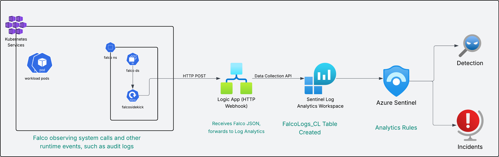

# Falco on AKS with Azure Sentinel Integration Demo

This repository contains the complete Infrastructure as Code (IaC) and configuration for demonstrating Falco runtime security on Azure Kubernetes Service (AKS) with Azure Sentinel integration.

## 📋 Overview

This demo showcases:
- **Falco**: Open-source cloud-native runtime security tool for threat detection
- **AKS**: Managed Kubernetes cluster on Azure (v1.33)
- **Azure Logic App**: HTTP webhook receiver for Falco alerts
- **Azure Log Analytics**: Centralized logging and monitoring with auto-created custom tables
- **Azure Sentinel**: SIEM solution with automated analytics rule deployment

## 🏗️ Architecture



### Component Flow

```
┌─────────────────────────────────────────────────────────────┐
│                    Azure Subscription                        │
│                                                              │
│  ┌────────────────────────────────────────────────────────┐ │
│  │              AKS Cluster                                │ │
│  │  ┌──────────────┐        ┌──────────────┐             │ │
│  │  │    Falco     │───────▶│ Falcosidekick│             │ │
│  │  │  (DaemonSet) │        │  (Forwarder) │             │ │
│  │  └──────────────┘        └──────┬───────┘             │ │
│  │                                  │ HTTP POST            │ │
│  └──────────────────────────────────┼──────────────────────┘ │
│                                     │                        │
│  ┌──────────────────────────────────▼──────────────────────┐ │
│  │         Logic App (HTTP Webhook)                        │ │
│  │  ┌─────────────────────────────────────────────────┐   │ │
│  │  │  Receives Falco JSON, forwards to Log Analytics │   │ │
│  │  └─────────────────────┬───────────────────────────┘   │ │
│  └────────────────────────┼─────────────────────────────────┘ │
│                           │ Data Collector API               │
│  ┌────────────────────────▼─────────────────────────────────┐ │
│  │         Log Analytics Workspace                         │ │
│  │  ┌─────────────────────────────────────────────────┐   │ │
│  │  │  FalcoLogs_CL (Auto-created Custom Table)       │   │ │
│  │  │  - Flattened JSON fields with _s suffix         │   │ │
│  │  │  - output_fields_k8s_pod_name_s                 │   │ │
│  │  │  - output_fields_container_id_s                 │   │ │
│  │  └─────────────────────────────────────────────────┘   │ │
│  └──────────────────────────────────────────────────────────┘ │
│                                     │                        │
│  ┌──────────────────────────────────▼──────────────────────┐ │
│  │         Azure Sentinel                                  │ │
│  │  ┌─────────────────────────────────────────────────┐   │ │
│  │  │  5 Analytics Rules (Auto-imported)              │   │ │
│  │  │  - Critical Security Alerts                     │   │
│  │  │  - Suspicious Process Execution                 │   │
│  │  │  - Sensitive File Access                        │   │
│  │  │  - Reverse Shell Detection                      │   │
│  │  │  - Multiple Alerts from Same Pod                │   │
│  │  └─────────────────────────────────────────────────┘   │ │
│  │  ┌─────────────────────────────────────────────────┐   │ │
│  │  │  Incidents & Investigations                     │   │
│  │  └─────────────────────────────────────────────────┘   │ │
│  └──────────────────────────────────────────────────────────┘ │
└─────────────────────────────────────────────────────────────┘
```

## 🚀 Quick Start

### Prerequisites

Before you begin, ensure you have the following installed:

- [Azure CLI](https://docs.microsoft.com/en-us/cli/azure/install-azure-cli) (version 2.30+)
- [kubectl](https://kubernetes.io/docs/tasks/tools/) (version 1.25+)
- [Helm](https://helm.sh/docs/intro/install/) (version 3.0+)
- [jq](https://stedolan.github.io/jq/) (for Sentinel rules import)
- `openssl` (used for deployment name suffix generation)
- `uuidgen` (used by deployment script prerequisites)
- `sha1sum` (GNU coreutils) **or** `shasum` (Perl) — either tool works for deterministic Sentinel rule IDs
- An active Azure subscription with appropriate permissions to create resources

### Installation

1. **Clone the repository**:
   ```bash
   cd Code
   ```

2. **Make scripts executable** (Bash only):
   ```bash
   chmod +x scripts/*.sh
   ```

3. **Review and customize parameters** (optional):
   Edit `main-subscription.bicepparam` (this is the file the deployment scripts
   actually consume — `main.bicepparam` is only used for resource-group-scoped
   deployments, which the scripts do not run by default). Customizable values:
   - `resourceGroupName` (default `rg-falco-demo-1`)
   - `aksClusterName`
   - `location`
   - `nodeVmSize` / `nodeCount`
   - `tags`

4. **Deploy the infrastructure**:
   ```bash
   ./scripts/deploy.sh
   ```

   | Flag | Description |
   |---|---|
   | *(none)* | Full deploy: infra → Falco → wait for logs → Sentinel rules |
   | `--enable-rules` | Re-import Sentinel rules only (no infra/Falco changes) |
   | `--skip-rules` | Deploy infra + Falco only; skip Sentinel rules |
   | `--no-wait` | Skip the `FalcoLogs_CL` population gate |
   | `--wait-timeout <min>` | Override the wait timeout (default: 20 minutes) |

   > **Resource naming**: The script automatically appends a random 6-character hex suffix
   > to all resource names (e.g. `rg-falco-demo-a3f9c1`, `aks-falco-demo-a3f9c1`,
   > `law-falco-demo-a3f9c1`) so each deployment is isolated and re-deployable without
   > name conflicts. The suffix is printed at the start of every run.
   - Create a resource group in East US
   - Deploy AKS cluster (v1.33, 3 nodes, Azure RBAC enabled)
   - Create Log Analytics workspace with Sentinel enabled
   - Deploy Logic App with HTTP webhook for log ingestion
   - Install Falco with Falcosidekick on the cluster
   - Configure Falcosidekick to send logs to Logic App webhook
   - Auto-create FalcoLogs_CL custom table via Data Collector API
   - **Automatically import 5 Sentinel analytics rules**

5. **Verify the deployment**:
   ```bash
   # Check Falco pods
   kubectl get pods -n falco
   
   # View Falco logs
   kubectl logs -n falco -l app.kubernetes.io/name=falco --tail=50
   
   # View Falcosidekick logs
   kubectl logs -n falco -l app.kubernetes.io/name=falcosidekick --tail=50
   ```

6. **Simulate attacks** (optional — generates real Falco detections for the demo):
   ```bash
   # Run all 7 attack scenarios
   ./scripts/simulate-attacks.sh

   # Run a specific scenario
   ./scripts/simulate-attacks.sh --scenario sensitive-file
   ./scripts/simulate-attacks.sh --scenario crypto-miner
   ./scripts/simulate-attacks.sh --scenario reverse-shell

   # Clean up attack namespaces
   ./scripts/simulate-attacks.sh --cleanup
   ```

   Available scenarios: `sensitive-file`, `package-mgmt`, `crypto-miner`, `reverse-shell`, `k8s-secrets`, `privileged-container`, `lateral-movement`

## 📁 Repository Structure

```
.
├── main-subscription.bicep             # Subscription-scoped Bicep template (entry point)
├── main-subscription.bicepparam        # Parameters for subscription-scoped deployment
├── main.bicep                          # Resource-group-scoped Bicep template
├── main.bicepparam                     # Parameters for resource-group-scoped deployment
├── modules/
│   ├── aks-cluster.bicep              # AKS cluster with RBAC
│   ├── log-analytics.bicep            # Log Analytics & Sentinel
│   └── logic-app.bicep                # Logic App webhook & Data Collector
├── k8s/
│   ├── falco-namespace.yaml           # Falco namespace
│   ├── falco-values.yaml              # Falco Helm values
│   ├── falcosidekick-config.yaml      # Falcosidekick configuration
│   └── sentinel-analytics-rules.json  # Sentinel analytics rules
├── workbooks/
│   └── falco-security-dashboard.json  # Falco Security Dashboard workbook
├── scripts/
│   ├── deploy.sh                      # Deployment script
│   ├── cleanup.sh                     # Cleanup script
│   └── simulate-attacks.sh            # Rogue actor attack simulation (7 scenarios)
└── README.md                          # This file
```

## 🔧 Configuration Details

### AKS Cluster Configuration

- **Kubernetes Version**: 1.33
- **Node Size**: Standard_D2s_v3
- **Node Count**: 3 nodes (system pool)
- **Network Plugin**: Azure CNI
- **Features Enabled**:
  - Azure RBAC for Kubernetes authorization (automatic role assignment for deploying user)
  - Azure Monitor for containers (diagnostic settings configured)
  - Container Insights integration

### Falco Configuration

- **Driver**: Modern eBPF (no kernel module required)
- **Output Format**: JSON
- **Priority**: Debug level and above
- **Custom Rules**: Included for AKS-specific scenarios
  - Unauthorized process execution
  - Sensitive file access
  - Kubernetes secret access
  - Package management detection
  - Reverse shell detection

### Logic App Integration

- **Trigger**: HTTP webhook (receives JSON from Falcosidekick)
- **Action**: Azure Log Analytics Data Collector API
- **Authentication**: Workspace customer ID + shared key
- **Data Format**: Raw JSON passthrough (no transformation)

### Log Analytics & Sentinel

- **Retention**: 30 days
- **Custom Table**: `FalcoLogs_CL` (auto-created by Data Collector API)
- **Table Structure**: Flattened JSON with `_s` suffix for strings
  - `output_fields_k8s_pod_name_s`
  - `output_fields_k8s_ns_name_s`
  - `output_fields_container_id_s`
  - `output_fields_user_name_s`
  - `priority_s`, `rule_s`, `hostname_s`, `output_s`
- **Analytics Rules**: 5 automatically imported rules with corrected KQL queries
- **Pricing Tier**: Pay-as-you-go (PerGB2018)

## 🧪 Testing the Setup

### 1. Generate Test Alerts

Run a test pod and trigger Falco rules:

```bash
# Create a test pod
kubectl run test-pod --image=alpine --rm -it -- sh

# Inside the pod, try these commands to trigger alerts:
# Trigger sensitive file access
cat /etc/shadow

# Trigger package management
apk add curl

# Trigger unauthorized process
nc -l -p 8080
```

### 2. View Logs in Azure

Navigate to Log Analytics workspace and run:

```kql
FalcoLogs_CL
| where TimeGenerated > ago(1h)
| project TimeGenerated, 
    PodName = output_fields_k8s_pod_name_s,
    Namespace = output_fields_k8s_ns_name_s,
    Priority = priority_s,
    Rule = rule_s,
    Output = output_s
| order by TimeGenerated desc
| take 50
```

### 3. Check Sentinel Incidents

1. Go to Azure Portal → Search "Microsoft Sentinel"
2. Select your Log Analytics workspace (e.g., `law-falco-demo-1`)
3. Left menu → **Configuration** → **Analytics** → **Active rules** tab
4. Filter by "Falco" to see the 5 imported rules
5. Navigate to **Threat management** → **Incidents** to see triggered alerts
6. Wait 5-10 minutes after first logs for rules to evaluate

**Direct Portal Link Format:**
```
https://portal.azure.com/#view/Microsoft_Azure_Security_Insights/MainMenuBlade/~/Analytics
```

## 📊 Sentinel Analytics Rules

The deployment includes pre-configured analytics rules:

1. **Critical Security Alert**
   - Severity: High
   - Frequency: Every 5 minutes
   - Detects: Critical priority alerts from Falco

2. **Suspicious Process Execution**
   - Severity: Medium
   - Frequency: Every 10 minutes
   - Detects: Unauthorized or suspicious processes

3. **Sensitive File Access**
   - Severity: High
   - Frequency: Every 5 minutes
   - Detects: Access to sensitive files and secrets

4. **Reverse Shell Detection**
   - Severity: High
   - Frequency: Every 5 minutes
   - Detects: Potential reverse shell connections

5. **Multiple Alerts from Same Pod**
   - Severity: High
   - Frequency: Every 10 minutes
   - Detects: Potentially compromised pods

## 🔍 Useful Queries

### View All Falco Alerts
```kql
FalcoLogs_CL
| summarize Count=count() by priority_s, rule_s
| order by Count desc
```

### Critical Alerts by Pod
```kql
FalcoLogs_CL
| where priority_s == "Critical"
| summarize Count=count() by output_fields_k8s_pod_name_s, rule_s
| order by Count desc
```

### Timeline of Security Events
```kql
FalcoLogs_CL
| summarize Count=count() by bin(TimeGenerated, 1h), priority_s
| render timechart
```

### Alerts by Namespace
```kql
FalcoLogs_CL
| summarize Count=count() by output_fields_k8s_ns_name_s, priority_s
| order by Count desc
```

## 🧹 Cleanup

To remove all resources created by this demo:

```bash
./scripts/cleanup.sh
```

**Warning**: This will permanently delete the resource group and all contained resources.

## 🛡️ Security Considerations

- **RBAC**: The deployment uses Azure RBAC for Kubernetes authorization
- **Network Policies**: Consider implementing network policies for additional security
- **Secrets Management**: In production, use Azure Key Vault for secrets
- **Node Security**: AKS nodes are configured with security best practices
- **Audit Logs**: All Kubernetes API audit logs are sent to Log Analytics

## 📚 Additional Resources

- [Falco Documentation](https://falco.org/docs/)
- [Falco Rules Reference](https://falco.org/docs/rules/)
- [AKS Documentation](https://docs.microsoft.com/en-us/azure/aks/)
- [Azure Sentinel Documentation](https://docs.microsoft.com/en-us/azure/sentinel/)
- [Falcosidekick](https://github.com/falcosecurity/falcosidekick)

## 🤝 Contributing

This is a demo project for educational purposes. Feel free to fork and customize for your needs!

## 📝 License

This project is provided as-is for demonstration purposes.

## 🎯 Demo Tips

1. **Start with simple violations**: Begin with file access to demonstrate detection
2. **Show log flow**: Demonstrate the journey from Falco → Falcosidekick → Log Analytics → Sentinel
3. **Highlight custom rules**: Show how easy it is to add custom detection rules
4. **Demonstrate incident response**: Use Sentinel's investigation features
5. **Discuss scalability**: Talk about handling alerts at scale

## ⚠️ Known Issues & Troubleshooting

### Log Ingestion
- Initial log ingestion may take 5-10 minutes
- Custom table `FalcoLogs_CL` is auto-created on first data arrival
- Logic App runs can be viewed in Azure Portal → Logic Apps → logic-falco-webhook → Overview

### Sentinel Rules
- First-time rule evaluation can take up to 10 minutes
- Rules are automatically imported during deployment (requires `jq` installed)
- Verify rules: Azure Portal → Sentinel → Analytics → Active rules (filter by "Falco")
- Rule queries use flattened column names (e.g., `output_fields_k8s_pod_name_s`)

### False Positives
- AKS system pods (ama-logs, kube-proxy, azure-policy) generate many alerts
- Consider filtering these in custom rules or Sentinel queries:
  ```kql
  | where output_fields_k8s_ns_name_s != "kube-system"
  ```

### Data Collector API
- Custom table limit: 10 tables (auto-created tables don't count against this)
- Column naming: Nested JSON flattened with underscores, string fields get `_s` suffix
- No pre-creation needed: Table schema is generated from first JSON payload

## 📞 Support

For issues or questions:
- Falco: [Falco Slack Community](https://kubernetes.slack.com/messages/falco)
- Azure: [Azure Support](https://azure.microsoft.com/support/)

---

**Happy Security Monitoring! 🔒**
